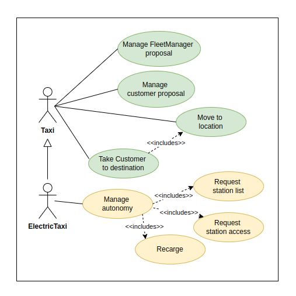

================================
Extending New Skills to an Agent
================================

Why Add New Skills to an Agent?
===============================

`Specialised details transform an actor into a true protagonist within their scenario.`

In a cinematic universe, some supporting characters share basic skills with the protagonists. For instance, a member
of a special operations team may use the same tactical suit as the leader, but the leader requires additional gadgets
and specialised skills that set them apart. While they share a common foundation, it’s the details that make the difference.

Adding skills to an agent is like equipping the team leader: it ensures they can not only fulfil their role but also excel
and contribute effectively to the system's success.

Problem: TaxiAgent
------------------

Continuing with the previous metaphor, the `TaxiAgent` is like a specialist in the tactical team, derived from the `TransportAgent`.
It already has the ability to move, interact, and transport passengers, but to become the leader (an efficient electric taxi),
it needs specific features such as autonomy and the ability to coordinate with charging stations. Without these skills,
its role as a protagonist in the system remains incomplete.

    Use case ElectricTaxi

Analysing the `TaxiAgent` problem, although `TaxiAgent` is a specialised class derived from `TransportAgent`, it has specific
limitations in a more complex context. For this reason, we reformulate and propose the creation of a new type of agent
called `ElectricTaxiAgent`, which incorporates the missing features.

**The Key Question Is:** How do we add the missing features?

**!Exactly, with Simfleet's Mixin Modules!**

Mixin Classes
=============

Mixin classes are powerful tools in object-oriented programming that enable the addition of specific functionalities to a class
without altering its base structure. In the context of Simfleet, Mixins allow agents to extend their capabilities to perform specific
tasks, such as moving or managing autonomy, making them more versatile and better suited to their context.

Below are two fundamental Mixins in Simfleet: `MovableMixin` and `ChargeableMixin`.

    Mixins

MovableMixin
------------

The `MovableMixin` class adds the ability for agents to move along a defined route towards a specific destination. This is essential
for agents that need to physically interact with other elements in a geographical space.

**Main Methods**

.. code-block:: python

    async def move_to(self, dest)
    def is_in_destination(self)
    def set_speed(self, speed_in_kmh)

* ``move_to()``
Requests a route from the current position to a destination and moves the agent along the calculated steps.

* ``is_in_destination()``
Checks if the agent has reached its destination.

* ``set_speed()``
Sets the agent's speed in kilometres per hour.

**Example of Use**

A `TaxiAgent`, as part of its strategy, can use ``move_to()`` to travel from its current location to the customer's location and then proceed
to the final destination. During the journey, the agent continuously checks if it has reached its destination and can interrupt the trip
at any point by using ``is_in_destination()``.

ChargeableMixin
---------------

The `ChargeableMixin` class enables agents to manage their autonomy level and perform actions related to consumption. It is essential for vehicle
or transport agents that rely on autonomy supply points.

**Main Methods**

.. code-block:: python

    def set_autonomy(self, autonomy, current_autonomy=None)
    def get_autonomy(self)
    def decrease_autonomy_km(self, expense=0)
    def increase_autonomy_km(self, expense=0)
    def increase_full_autonomy_km(self)
    def calculate_km_expense(self, current_pos, origin, dest=None)
    def has_enough_autonomy(self, orig, dest)

* ``set_autonomy()``
Sets the agent's maximum and current autonomy.

* ``get_autonomy()``
Returns the agent's current autonomy level.

* ``decrease_autonomy_km()``
Reduces the agent's current autonomy based on a completed journey.

* ``increase_autonomy_km()``
Increases the agent's current autonomy, up to the maximum limit.

* ``increase_full_autonomy_km()``
Restores the agent's autonomy to its maximum value, simulating a full recharge.

* ``calculate_km_expense()``
Calculates the energy expenditure in kilometres for a journey from the current position to the destination.

* ``has_enough_autonomy()``
Checks if the agent has sufficient autonomy to complete a trip.

**Example of Use**

An `ElectricTaxiAgent`, as part of its strategy, can check if it has sufficient autonomy to complete a trip
using ``has_enough_autonomy()`` before accepting a journey. If the trip exceeds its available autonomy, the agent will
locate and travel to a nearby charging station, use ``increase_full_autonomy_km()`` to restore its autonomy, and then
proceed to accept the customer's trip.

New Agent: ElectricTaxiAgent
============================

Analysing the use case for the `ElectricTaxi`, we observe that a specialised transport agent (`TaxiAgent`) is sufficient
to model taxis that cover the proposed use cases. However, it does not address the new needs that we have identified and added.

To meet these requirements, we extend its functionalities by integrating the `ChargeableMixin` class and customise a new agent,
`ElectricTaxiAgent`, to fulfil the missing need in our use case: **Manage autonomy**.

    ElectricTaxiAgent

**Main Methods**

.. code-block:: python

    def set_stations(self, stations)
    def get_stations(self)
    def get_number_stations(self)
    def set_nearby_station(self, station)
    def get_nearby_station(self)
    def get_nearby_station_id(self)
    def get_nearby_station_position(self)

* ``set_stations()``
Defines the list of available charging stations.

* ``get_stations()``
Returns the list of registered charging stations.

* ``get_number_stations()``
Returns the total number of available stations.

* ``set_nearby_station()``
Sets the configuration for the nearest charging station to the agent.

* ``get_nearby_station()``
Retrieves the configuration for the nearest charging station to the agent.

* ``get_nearby_station_id()``
Retrieve the ID of the nearest charging station.

* ``get_nearby_station_position()``
Retrieve the position of the nearest charging station.

With this customisation, the `ElectricTaxiAgent` can monitor and manage its autonomy, calculate energy expenditure for journeys, and select nearby charging stations.
