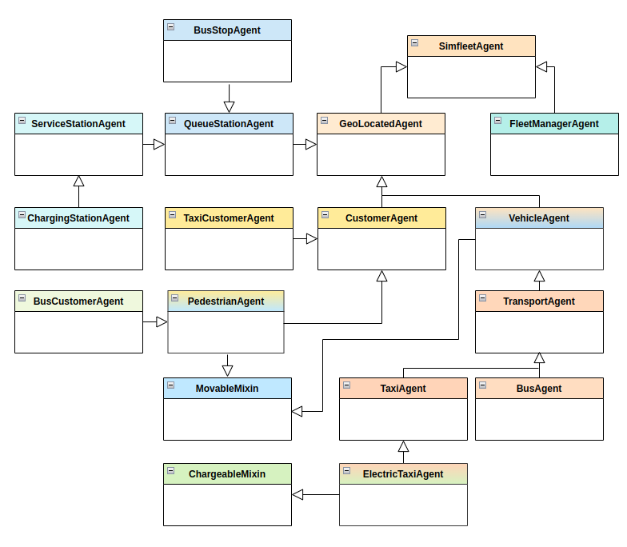

============
Architecture
============

A modular design?
=================

SimFleet follows a modular design that simplifies the creation of urban transport simulations
by combining different types of agents and functionalities. This modular approach allows components
to be added, modified, or reused independently, providing flexibility.

    Modules

`To understand is to uncover the map, to organise is to trace the paths, to structure is to build`
`the bridges, and to expand skills is to explore the horizon without limits.`

Taking the previous metaphor into account, we can say that the modularity implemented in SimFleet assists
the user through:

* **Class Hierarchy and Package Structure:**

The main classes define basic agents, while customised ones extend their functionalities. The organisation
into packages ensures that each element serves a specific role, simplifying maintenance and facilitating
system expansion. For more information (see **LINK**)

* **Mixins:**

These are special classes with shared functionalities that help expand an agent's new abilities. This avoids
code duplication and allows different agents to share common characteristics. For more information (see **LINK**)

* **Strategy Pattern:**

Agents can expand their strategic abilities through the use of the Strategy Pattern. Agent behaviours are
defined by strategies that can be changed at runtime. This enables the customisation of agent actions without
modifying the core code. For more information (see **LINK**)

This modular design makes SimFleet adaptable and extensible, making it ideal for experimenting with and optimising
different mobility configurations.

Class Hierarchy and Package Structure
=====================================

The Class Hierarchy and Package Structure of SimFleet are designed to be modular and clear, making the simulator
easily extensible. Below is a description supported by the visual diagram:

    Simfleet hierarchy

    Simfleet packages

Each class, module, and package is represented with a distinct colour in the diagrams to facilitate visual identification.
For example:

#. **The main agent classes** are represented with unique colours to easily differentiate their roles within the simulation. However, the classes `VehicleAgent` and `PedestrianAgent`, which use the `MovableMixin`, serve as both a Mixin variant and a main agent class.

#. **Custom agent classes** are shown with the same colours as the main classes from which they derive.

#. **Mixins** are highlighted in blue for MovableMixin and green for ChargeableMixin, emphasising their role as reusable components.

#. **Packages** such as `metrics`, `utils`, and `lib` are assigned distinct colours to differentiate their support and specialised functions within the system.

Main Agent Classes
==================

SimFleet is built on a series of main agent classes that represent the fundamental components of the mobility simulation system.
These classes provide the essential functionality for different types of agents and serve as the foundation for creating specialised
agents. Below is a description of each of these main classes:

VehicleAgent
------------

The `VehicleAgent` class serves as a base for representing vehicles within the system. It is built upon the inheritance of
two main classes: `GeoLocatedAgent` and `MovableMixin`.

.. figure:: images/architecture/vehicle-class.png
    :align: center
    :alt: Vehicle

    Vehicle

By inheriting from these two classes, the `VehicleAgent` integrates advanced geolocation and mobility capabilities, enabling it to set
and retrieve its position on a map as well as manage movement between locations. It includes functionalities such as route requests,
moving towards a destination, and calculating distances and speeds.

Additionally, this class supports registration with and communication to a fleet manager, the `FleetManagerAgent`, allowing it to
coordinate its movements and receive instructions within an organised fleet.

**Main Methods**

.. code-block:: python

    def set_fleetmanager(self, fleetmanager_id)
    def set_target_position(self, coords=None)
    async def set_position(self, coords=None)

* ``set_fleetmanager()``
Associates the vehicle with a specific fleet manager.

* ``set_target_position()``
Sets the vehicle's destination. If no coordinates are provided, a random position is assigned as the destination.

* ``set_position()``
Sets the vehicle's position, extending the functionality inherited from `GeoLocatedAgent`

TransportAgent
--------------

The `TransportAgent` class extends the functionalities of `VehicleAgent` to specialise in managing tasks related to passenger transportation.
It is a crucial part of the transport management system, capable of assigning and managing clients as well as sending updates on the journey
status to clients. By inheriting from `VehicleAgent`, `TransportAgent` also retains the movement and geolocation capabilities required to operate
in a complex environment.

    TransportAgent

**Main Methods**

.. code-block:: python

    async def inform_customer_moving(self, customer_id, status, data=None)
    async def inform_customer(self, customer_id, status, data=None)
    async def cancel_customer(self, customer_id, data=None)
    def add_customer_in_transport(self, customer_id, origin=None, dest=None)
    def remove_customer_in_transport(self, customer_id)
    async def set_position(self, coords=None)

* ``inform_customer_moving()``
Notifies the client when the transport is in motion, including details such as the current location during the journey.

* ``inform_customer()``
Updates the client on the transport's new status. This can be used to notify events such as arrival at the destination or changes in location.

* ``cancel_customer()``
Cancels the client assignment and informs them via a message. This is useful when the service cannot be provided.

* ``add_customer_in_transport()``
Adds a client to the transport and tracks their origin and destination. It also increments the assignment counter.

* ``remove_customer_in_transport()``
Removes a client from the transport and decrements the assignment counter.

* ``set_position()``
Sets the transport's position and updates clients with the new location information.

CustomerAgent
-------------

The `CustomerAgent` class is responsible for representing customers in the simulation. It handles tasks such as tracking the destination and communicating
with the assigned transport agent to update its position. It inherits from `GeoLocatedAgent`, enabling it to manage its geographic position.

    CustomerAgent

**Main Methods**

.. code-block:: python

    async def setup(self)
    def set_target_position(self, coords=None)
    def get_target_position(self)
    async def set_position(self, coords=None)

* ``setup()``
An asynchronous method that configures the agent. It adds the TravelBehaviour, which manages the client's journeys when transport is assigned.
This behaviour handles the reception of the transport and updates the client's status during the trip.

* ``set_target_position()``
Sets the client's destination. If no specific position is provided, the destination is assigned randomly. This method determines where the client is headed.

* ``get_target_position()``
Returns the destination of the currently stored customer. Provides information on where the agent is heading.

* ``set_position()``
Sets the client's current position. If no coordinates are provided, the position is randomly assigned within the agent's operational area.

Travel Behaviour
~~~~~~~~~~~~~~~~

The `TravelBehaviour` manages the client's position updates based on notifications sent by the transport during the journey.
The `TransportAgent` uses the ``set_position()`` method to establish its current position, which triggers a notification to assigned
clients via a message using the `TRAVEL_PROTOCOL`. This message includes the state `CUSTOMER_LOCATION`, indicating the transport's
current position along with updated coordinates.

The `CustomerAgent`, through its `TravelBehaviour`, continuously listens for messages related to the `TRAVEL_PROTOCOL`. Upon receiving
a message with the state `CUSTOMER_LOCATION`, the client extracts the coordinates provided by the transport and updates its position
using the ``set_position()`` method. This ensures the client's location remains synchronised with the transport in real time, efficiently
managing the journey without manual intervention.

.. warning::
  This behaviour is internal and automatic. It is not intended to be modified during the development of new negotiation strategies.
  Similarly, the `TRAVEL_PROTOCOL` must remain unchanged to ensure system integrity.

PedestrianAgent
---------------

The `PedestrianAgent` class represents pedestrians within the simulation and extends the functionalities of `CustomerAgent` to include the
ability to track destinations and communicate with the transport agent to update its movement. This class also inherits from `MovableMixin`,
enabling it to calculate and execute movements towards destinations autonomously, simulating pedestrian behaviour in the simulation environment.

    PedestrianAgent

**Main Methods**

.. code-block:: python

    def set_pedestrian_dest(self, coords=None)
    def get_pedestrian_dest(self)
    async def set_position(self, coords=None)

* ``set_pedestrian_dest()``
Sets the pedestrian's destination. This is useful for defining where the agent is headed within the simulation.

* ``get_pedestrian_dest()``
Retrieves the currently stored destination of the pedestrian. This method provides information about the agent's intended direction.

* ``set_position()``
Sets the pedestrian's position, extending the functionality inherited from `CustomerAgent`.

QueueStationAgent
-----------------

The `QueueStationAgent` class is a component designed to manage queues of agents requesting services in a simulated environment.
This agent leverages geolocation capabilities inherited from the `GeoLocatedAgent` class, enabling precise and coordinated spatial control.
Its primary goal is to efficiently organise and process requests in a queue.

    QueueStationAgent

What Can It Do?
~~~~~~~~~~~~~~~

The `QueueStationAgent` offers several functionalities that make it essential for the coordination and management of queues in a mobility simulation:

#. **Manage Waiting Queues:** It can manage queues of agents for various tasks, ensuring that each agent is served in the order of arrival.

#. **Communication:** It can accept or reject agents' requests to join the queue, based on service availability or the proximity of the agent.

#. **Register the Station in the Directory:** It provides mechanisms to register itself in the global simulation system, ensuring that other agents can discover its services.

Main Methods
~~~~~~~~~~~~

.. code-block:: python

    async def setup(self)
    def add_queue(self, name)
    def remove_queue(self, name):

* ``setup()``
Configures behaviours and message templates to handle requests and cancellations.

* ``add_queue()``
Adds a specific queue to the agent.

* ``remove_queue()``
Removes a specific queue from the agent.

This agent implements an independent `QueueBehaviour` and oversees separate functionalities. For more information (see **LINK**)

ServiceStationAgent
-------------------

The `ServiceStationAgent` class represents a service station in a simulation environment. It extends the functionality of the `QueueStationAgent` class,
adding specific capabilities to manage services with limited slots using a queueing system. Agents can request services and wait in the queue until
the required slots become available.

    ServiceStationAgent

What Can It Do?
~~~~~~~~~~~~~~~

The QueueStationAgent offers several functionalities that make it essential for the coordination and management of queues in a mobility simulation:

#. **Management of Services with Slots:** Enables the management of services with a specific number of available slots.

#. **Communication:** Utilises protocols to accept, reject, and inform agents about the status of their requests.

#. **Integration with Custom Behaviours:** Each service is associated with a unique behaviour, allowing for customisation of the operations performed by the station when attending to an agent.

Main Methods
~~~~~~~~~~~~

.. code-block:: python

    def add_service(self, service_name, slots, one_shot_behaviour, **arguments)
    def remove_service(self, service_name)
    def show_services(self)
    def show_service_arguments(self, service_name)
    def service_available(self, service_name)

* ``add_service()``
Adds a service to the station with a defined number of slots and an associated behaviour.

* ``remove_service()``
Removes a specific service from the station.

* ``show_services()``
Returns a list of the names of available services.

* ``show_service_arguments()``
Retrieves the arguments associated with a specific service.

* ``service_available()``
Checks whether a service has available slots.

This agent implements an independent `RunServiceBehaviour` and oversees separate functionalities. For more information (see **LINK**)

FleetManagerAgent
-----------------

The `FleetManagerAgent` class is responsible for managing a fleet of transport agents. This agent registers the transport agents in its
fleet and coordinates requests between transports and customers. It extends the SimfleetAgent class, which provides basic agent functionalities
and communication mechanisms within the simulation system.

    FleetManagerAgent

**Main Methods**

.. code-block:: python

    async def setup(self):
    def clear_agents(self):

* ``setup()``
Configures the FleetManagerAgent by establishing a behaviour to handle the registration of transport agents. This behaviour is automatically activated when the agent starts.

* ``clear_agents()``
Clears the list of registered transport agents and resets the simulation clock. This method is useful for resetting the fleet manager's state between sessions.

Custom Agent Classes
====================

SimFleet is built on a series of main agent classes that represent the fundamental components of the mobility simulation system.
These classes provide the essential functionality for different types of agents and serve as the foundation for creating specialised
agents. Below is a description of each of these main classes:

TaxiAgent
---------

The `TaxiAgent` class represents a taxi within the simulation and inherits from TransportAgent. This class is designed to manage
assigned customers and provide specific functionalities for taxis, such as accepting or cancelling passenger assignments.
Its focus is on delivering an efficient transportation experience within the simulation.

    Taxi

**Main Methods**

.. code-block:: python

    async def add_assigned_taxicustomer(self, customer_id, origin=None, dest=None)
    async def remove_assigned_taxicustomer(self)

* ``add_assigned_taxicustomer()``
Stores information when a customer is in the process of negotiating with the transport. This allows the taxi to manage
the transport in detail, always knowing the passenger's starting and destination points.

* ``remove_assigned_taxicustomer()``
Removes all customers from the list of assigned customers. This is useful for freeing the taxi when the customer completes negotiations.

ElectricTaxiAgent
-----------------

The `ElectricTaxiAgent` class represents an electric taxi within the simulation and extends the capabilities of `TaxiAgent` by integrating
specific functionalities for managing charging stations. It also leverages the `ChargeableMixin` to provide features related to electric
charging, enabling the taxi to manage its autonomy effectively.

.. figure:: images/architecture/electrictaxi-class.png
    :align: center
    :alt: ElectricTaxiAgent

    ElectricTaxiAgent

**Main Methods**

.. code-block:: python

    def set_stations(self, stations)
    def get_stations(self)
    def get_number_stations(self)
    def set_nearby_station(self, station)
    def get_nearby_station(self)
    def get_nearby_station_id(self)
    def get_nearby_station_position(self)

* ``set_stations()``
Defines the list of available charging stations.

* ``get_stations()``
Returns the list of registered charging stations.

* ``get_number_stations()``
Returns the total number of available stations.

* ``set_nearby_station()``
Sets the configuration for the nearest charging station to the agent.

* ``get_nearby_station()``
Retrieves the configuration for the nearest charging station to the agent.

* ``get_nearby_station_id()``
Retrieve the ID of the nearest charging station.

* ``get_nearby_station_position()``
Retrieve the position of the nearest charging station.

TaxiCustomerAgent
-----------------

The `TaxiCustomerAgent` class represents a customer in the taxi fleet simulation system. It inherits from `CustomerAgent`
and provides additional functionalities that allow customers to request transport services, accept or reject proposals,
and interact with fleet managers. This agent is key to simulating the experience of a passenger needing to navigate
through a taxi system.

.. figure:: images/architecture/taxicustomer-class.png
    :align: center
    :alt: TaxiCustomer

    TaxiCustomer

**Main Methods**

.. code-block:: python

    def set_fleetmanagers(self, fleetmanagers)
    def get_fleetmanagers(self)
    def set_transport_assigned(self, transport_id)
    def clear_transport_assigned(self)

* ``set_fleetmanagers()``
Stores the available fleet managers with whom the customer can interact.

* ``get_fleetmanagers()``
Returns the list of fleet managers.

* ``set_transport_assignment()``
Stores the transport the customer is currently interacting with.

* ``clear_transport_assignment()``
Clears the transport the customer is currently interacting with.

BusAgent
--------

The `BusAgent` class represents a bus within the simulated transport system. It manages bus line stops, capacity,
and interactions with passengers. It extends the functionalities of `TransportAgent`, enabling the bus to move in a
planned manner along a predefined route of stops.

    Bus

**Main Methods**

.. code-block:: python

    def set_line(self, line)
    def set_line_type(self, line_type)
    def set_stop_list(self, stop_list)
    def set_capacity(self, capacity)
    async def set_position(self, coords=None)
    def setup_current_stop(self)
    async def arrived_to_stop(self)

* ``set_line()``
Sets the bus line identifier for the agent.

* ``set_line_type()``
Sets the type of line for the transport.

* ``def set_stop_list()``
Sets the list of stops for the bus line.

* ``def set_capacity()``
Sets the capacity of the bus and initializes the current capacity.

* ``async def set_position()``
Clears the transport the customer is currently interacting with.

* ``def setup_current_stop()``
Sets the current stop based on the transport's position.

* ``async def arrived_to_stop()``
Marks the current stop as arrived and triggers the event.

BusStopAgent
------------

The `BusStopAgent` class represents a bus stop within the transport simulation system. This agent handles customer
registration, notifies customers of bus arrivals, and monitors the status of the stop. It extends the `QueueStationAgent`
class, enabling efficient management of passenger queues and coordination of bus arrivals and departures.

    BusStop

**Main Methods**

.. code-block:: python

    def set_type(self, station_type)
    def set_lines(self, lines)

* ``set_type()``
Specifies the type of the stop (e.g., a regular bus stop), allowing differentiation between various types of stops or
stations within the system.

* ``set_lines()``
Assigns the bus lines that serve the stop, specifying which buses will pick up passengers at that location.

BusCustomerAgent
----------------

The `BusCustomerAgent` class represents a customer using the bus service within the transport simulation system.
This agent inherits from `PedestrianAgent` and manages the customer's interaction with the public transport system,
including stop configuration, wait times, and registration at bus stops. BusCustomerAgent simulates the experience
of a passenger using a bus to reach their destination.

    BusCustomer

**Main Method**

.. code-block:: python

    def set_line(self, line)

* ``set_line()``
Sets the bus line the customer will use to reach their destination.

ChargingStationAgent
--------------------

The `ChargingStationAgent` class represents a charging station within the simulation system. This class provides charging
services for electric vehicles and may also offer additional services, such as refuelling gasoline, diesel or charging.
`ChargingStationAgent` extends the `ServiceStationAgent` class, enabling it to manage waiting queues and the services
requested by vehicles.

.. figure:: images/architecture/chargingstation-class.png
    :align: center
    :alt: ChargingStation

    ChargingStation

.. note::
    It is important to consider that it is necessary to create a custom service behaviour for the agent.
