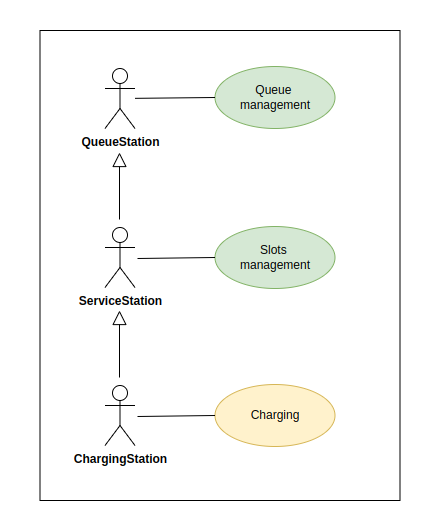

=======================
Customisation of Agents
=======================

Why Customise Agents?
=====================

`Customising an agent is like tailoring a suit for an actor: the details reflect the role it will play on the stage.`

A generic suit doesn’t fit everyone. Just as an actor needs a wardrobe suited to their character, a customised agent is
designed to meet specific user requirements, making its performance more precise and meaningful.

What Idea Are We Simulating?
----------------------------

Before developing customised agents, it is essential to conceptualise the idea first. For example:

In modern cities, transport systems are dynamic and complex. By customising agents, we can simulate specific scenarios
such as taxi behaviour, customer demand, and the management of electric vehicle charging points.

**Main Idea:** Exploring Smart Mobility: Taxis, Customers, and Energy

Designing the Idea
------------------

Once the idea is established, we proceed to design it, considering which main agent it would derive from. To do this,
we need to identify the key actors and their needs through a UML use case system.

.. figure:: images/customise-agents/fleetmanager-uc.png
    :align: center
    :alt: Use case FleetManager

    Use case FleetManager

.. figure:: images/customise-agents/taxi-uc.png
    :align: center
    :alt: Use case Taxi

    Use case Taxi

    Use case TaxiCustomer

    Use case ChargingStation

As we can observe from the key actors **TaxiCustomer**, **Taxi**, **FleetManager**, and **ChargingStation** in our use case diagram,
we can determine the new types of agents that need to be customised.

**New Agent Classes:** `TaxiCustomerAgent`, `TaxiAgent`, `ChargingStationAgent`

.. note::
    The `FleetManagerAgent` is already created and does not require specialisation, as it possesses the necessary features to manage requests effectively.

New Transport: TaxiAgent
========================

Analysing our use case for the `Taxi`, we can see that a generic transport agent (`TransportAgent`) is sufficient to model basic transport
functionalities that cover the use cases **Move to location** and **Take TaxiCustomer to destination**. However, it does not address the additional needs.

Thus, we customise the TaxiAgent to meet the remaining requirements in our use case (**Manage FleetManager request** and **Manage the Proposal**).

.. figure:: images/customise-agents/taxi-dc.png
    :align: center
    :alt: Taxi

    Taxi

**Main Methods**

.. code-block:: python

    async def add_assigned_taxicustomer(self, customer_id, origin=None, dest=None)
    async def remove_assigned_taxicustomer(self)

* ``add_assigned_taxicustomer()``
Stores information when a customer is in the negotiation process with the transport.

* ``remove_assigned_taxicustomer()``
Deletes the customer's information.

With this customisation, `TaxiAgent` can interact directly with its `FleetManagerAgent` and manage the direct relationship between the taxi and the customer.

New Customer: TaxiCustomerAgent
===============================

Analysing the `TaxiCustomer` use case, we find that a generic customer agent (`CustomerAgent`) is sufficient to model basic customers
that cover the use case **Interacting with the taxi**. However, it does not address the additional requirements.

Thus, we customise the `TaxiCustomerAgent` to meet the remaining needs in our use case (**Request Taxi from FleetManager** and **Manage the Proposal**).

.. figure:: images/customise-agents/taxicustomer-dc.png
    :align: center
    :alt: TaxiCustomer

    TaxiCustomer

**Main Methods**

.. code-block:: python

    def set_fleetmanagers(self, fleetmanagers)
    def get_fleetmanagers(self)
    def set_transport_assigned(self, transport_id)
    def clear_transport_assigned(self)

* ``set_fleetmanagers()``
Stores the available fleet managers with whom the customer can interact.

* ``get_fleetmanagers()``
Returns the list of fleet managers.

* ``set_transport_assignment()``
Stores the transport the customer is currently interacting with.

* ``clear_transport_assignment()``
Clears the transport the customer is currently interacting with.

With this customisation, the `TaxiCustomerAgent` can directly interact with available fleet managers and handle negotiations with the taxi.

New Station: ChargingStationAgent
=================================

Analysing the `ChargingStation` use case, we observe that a generic service station agent (`ServiceStationAgent`) is sufficient to model a station that covers
the use cases **Slots management** and **Queue management**. However, it does not address the requirement of the **Charging** use case.

In this regard, we can approach the idea with two alternatives:

#. Create a customised agent by adding features to meet the required needs.

#. Use the features offered by the `ServiceStationAgent` and add a `Custom Behaviour`.

Both alternatives are valid. However, the second is more effective and reasonable. For this illustrative example,
we will create a customised agent inheriting from `ServiceStationAgent`.

    ChargingStation

**Code**

.. code-block:: python

    class ChargingStationAgent(ServiceStationAgent):
    def __init__(self, agentjid, password):
        ServiceStationAgent.__init__(self, agentjid, password)

.. note::
    It is important to consider that we are not yet addressing the **Charging** need in our use case. To fulfil this requirement, it is necessary to create a custom behaviour for the agent. For instructions on creating this behaviour, please refer to (f. Developing Behaviour: ChargingStationAgent).
