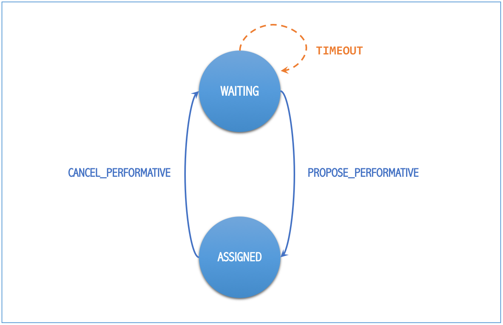

=========================
Developing New Strategies
=========================

Introduction
============

One of the main features of "Taxi Simulator" is the ability to change the default negotiation strategy of the agents that interact
during the simulation: the Coordinator agent, the Taxi agents and the Passenger agents. The overall goal of the negotiation
strategy of these three agent types is to decide which Taxi agent will transport each Passenger agent to its destination, making
sure that no Passenger agent is left unattended. Additionally, the negotiation strategy may also try to optimize some metrics,
such as the average time that Passenger agents are waiting to be served, or that the amount of gas spent by Taxi in their movements.

The negotiation strategy is based on two main elements. First, it is based on the internal logic of each agent type
(Coordinator, Taxi and Passenger) and, in particular, on their respective *strategy behavior*, which includes the
internal logic of each agent type regarding the negotiation process. And second, it is also based on the so-called `REQUEST`
protocol, which comprises the types of messages exchanged among the three agent types during the negotiation.
The following diagram presents the protocol in the typical FIPA format, where agents types are depicted as vertical lines
and the exchanged message types (or "performatives") in horizontal arrows:

.. image:: Request_protocol.png
   :scale: 40 %
   :align: center

This chapter introduces first the current, default strategy of each agent type (Coordinator, Taxi and Passenger) and
then explains how to introduce new strategies for any, or all, of them.

Description of the Coordinator Agent
------------------------------------

The Coordinator Agent is responsible for putting in contact the Passenger agents that need a taxi service, and the Taxi
agents that may be available to offer these services. In short, the Coordinator Agent acts like a taxi call center, accepting
the incoming requests from customers (Passenger agents) and forwarding these requests to the (appropriate) Taxi agents.
In order to do so, the Coordinator agent knows the names and addresses of every Passenger and Taxi agent registered in
the system.

In the context of the Taxi Simulator, a "taxi service" involves, once a particular Passenger
and Taxi agents have reached an agreement, the movement of the Taxi agent from its current position to the Passenger's position in
order to pick the Passenger up, and then the transportation of the Passenger agent to its destination.

The Coordinator Agent includes a single behavior, which is its strategy behavior, now described.

Strategy Behaviour (`DelegateRequestTaxiBehaviour`)
~~~~~~~~~~~~~~~~~~~~~~~~~~~~~~~~~~~~~~~~~~~~~~~~~~~

The goal of the stategy behavior of the Coordinator Agent is basically to **receive** the "request" messages (`REQUEST_PERFORMATIVE`)
sent by the Passenger agents that need a taxi service and, for each request, selecting the Taxi agent, or agents,
that may perform the service,
and **forward** the request to them. A `REQUEST_PERFORMATIVE` message includes the following fields::

                "passenger_id": Id of the Passenger agent that performs the request.
                "origin":       Current position of the Passenger, where the Taxi has to pick it up.
                "dest":         Destination of the Passenger, where the Taxi needs to transport it.

The particular set of Taxi agents to which the request will be forwarded depends on the *allocation policy* of the Coordinator
Agent, which is part of the strategy. In the default strategy behavior for the Coordinator agent (`DelegateRequestTaxiBehaviour`),
the allocation policy is the simplest posible: it forwards every incoming request to **all** the Taxi agents,
regardless of their current statuses or any other consideration (such as, for example, the last time they performed a service,
or the distance between them and the Passenger agent).

In the default strategy behavior, the set of incoming messages that may be delivered to the Coordinator Agent is reduced
to the requests made by Passenger agents, and the behavior itself does not include multiple states. So, each incoming message
is processed in the same way, and leaves the behavior in the same (unique) state.

Once each request has been forwarded to some (or all) the Taxi agents, the goal of the Coordinator Agent for that request
is achieved. This is the starting point to the negotiation between the Passenger that has issued the request and the
Taxi agents that have received it, which is described in the following sections.

Description of the Taxi Agents
------------------------------

The Taxi agents represent vehicles which can transport Passenger agents from their current positions to their respective
destinations. In order to do that, Taxi agents incorporate two behaviors: the strategy behavior and the moving behavior,
now described.

Strategy Behaviour (`AcceptAlwaysStrategyBehaviour`)
~~~~~~~~~~~~~~~~~~~~~~~~~~~~~~~~~~~~~~~~~~~~~~~~~~~~

The goal of the strategy behavior of a Taxi agent is to negotiate with Passenger agents which are requesting a taxi service
the conditions of the service offered by the Taxi, in order to achieve an agreement with these Passenger agents.
When an agreement is reached between a particular Passenger and Taxi agents, then the Taxi agent picks up the
Passenger agent and transport it to its destination (and starts the Moving Behavior, described below).

The currently implemented, default strategy behavior is called `AcceptAlwaysStrategyBehaviour`, and has a direct
relation with the `REQUEST` protocol explained above. In particular, the behavior can be thought of as a finite-state
machine with some different states specifying the statuses of the Taxi agent regarding the strategy behavior, and
some transitions between states, wich are triggered either by messages (of the `REQUEST` protocol) received by the
Taxi agent, or by some other program conditions. This is depicted in the following diagram:

.. figure:: Taxi_FSM.png
   :scale: 40 %
   :align: center

   States and transitions of the strategy behavior of a Taxi agent.

The semantics of each state are now described:

* `TAXI_WAITING`: In this state, the Taxi agent is available (free) and waiting for requests from Passenger agents.
  While in this state, if it receives a request message (`REQUEST_PERFORMATIVE`) from a particular Passenger agent,
  it will send the Passenger a service proposal (`PROPOSE_PERFORMATIVE`) and it will change its state to
  `TAXI_WAITING_FOR_APPROVAL`.

* `TAXI_WAITING_FOR_APPROVAL`: In this state, the Taxi agent is waiting for the response message from a Passenger agent
  to which it has sent a service proposal message. While in this state, it may receive two alternative answers from
  the Passenger agent: (1) the Passenger refuses the service proposal (`REFUSE_PERFORMATIVE`), in which case the Taxi
  changes its state back to `TAXI_WAITING`; or (2) the Passenger accepts the proposal (`ACCEPT_PERFORMATIVE`), in
  which case it will change to the state `TAXI_MOVING_TO_PASSENGER`.

* `TAXI_MOVING_TO_PASSENGER`: In this state, the Taxi agent and the Passenger agent have agreed to perform a taxi
  service, and then the Taxi agent starts to travel to the Passenger location in order to pick it up. This is
  the final state of the negotiation between the Taxi and a certain Passenger agent. In this state, the Taxi agent
  executes the helper function `pick_up_passenger`, which automatically starts the so-called Moving Behavior
  in the Taxi agent, described below. It also sends a message to the Travel Behavior of the Passenger agent, which
  starts that behavior (this is explained in the next section).

Moving Behaviour
~~~~~~~~~~~~~~~~
This behavior makes the Taxi agent to move to the current location of the Passenger agent with which it has reached
an agreement to perform a taxi service. After picking the Passenger agent up, the Taxi will then transport it to
its destination.

Once in the Passenger agent's destination, the Passenger agent is informed, and then the state of the Taxi agent
is again changed to `TAXI_WAITING`, indicating that it is now free again, and it may start receiving new requests
from other Passenger agents.

WARNING: This behavior is internal and automatic, and it is not intended to be modified while developing
new negotiation strategies.

Description of the Passenger Agents
-----------------------------------

The Passenger agents represent people that need to go from one location of the city (their "current location") to
another (their "destination"), and for doing so, they request a taxi service. Each Passenger agent requires a single
taxi service and so, once transported to its destination, it reaches its final state and ends its execution. During
that execution, Passenger agents incorporate two behaviors: the strategy behavior and the travel behavior, now described.

Strategy Behaviour
~~~~~~~~~~~~~~~~~~

In the course of the `REQUEST` protocol, the request of a taxi service made by a Passenger agent is answered
by one (or several) Taxi agents, each of which offering the Passenger their conditions to perform such service.
The goal of the strategy behavior of a Passenger agent is to select the best of these taxi service proposals,
according to its needs or preferences (e.g., to be picked up faster, to get the nearest available taxi,
to get the cheapest service, etc.).

The currently implemented, default strategy behavior is called `AcceptFirstRequestTaxiBehaviour`. As in the
strategy behavior of the Taxi agents above, here we can also consider the strategy as a finite-state machine related to
the messages (of the `REQUEST` protocol) received by the Passenger agent, as depicted below:

   States and transitions of the strategy behavior of a Passenger agent.

The semantics of each state are now described:

* `PASSENGER_WAITING`: In this state, the Passenger agent requires a taxi service and, periodically, sends a
  request for that service until one (or many) Taxi agent proposals (`PROPOSE_PERFORMATIVE`) are received.
  When the Passenger accepts a particular proposal (in the current implementation, always the first one it
  receives while in this state) then it communicates so to the proposing Taxi agent, and changes its own status
  to `PASSENGER_ASSIGNED`.

* `PASSENGER_ASSIGNED`: In this state, the Passenger agent has been assigned to a particular taxi, and the taxi service
  is being produced. The Passenger side of the taxi service is implemented by activating the Travel Behavior, described
  below, which is started by a message sent by the Taxi agent (in its helper function `pick_up_passenger`).
  If something goes wrong (for example, an exception is raised during the taxi service) or the Taxi agent voluntarily
  wants to cancel the service, then the Taxi agent sends a `CANCEL_PERFORMATIVE` to the Passenger agent, which
  would then change its status back to `PASSENGER_WAITING`, initiating the request process again.

Travel Behaviour
~~~~~~~~~~~~~~~~
Goals, Actions, States.

The Negotiation Process between Taxi and Passenger Agents
---------------------------------------------------------

After separately explaining the strategy behavior of Taxi and Passenger agents, this section tries to relate both behaviors.
This is important to understand how these two agent types interact with each other in order to coordinate and reach the overall
goals of the simulation.

In particular, there are three key aspects (embedded within the strategy behaviors) which influence the overall
coordination process implemented in the simulator, as now described:

* The conditions of a taxi service proposal. The current implementation does not consider any special condition other
than the Taxi agent being free (available to perform the service). Some aspects that could be included in a taxi proposal
would be, for example, the current location of the taxi, the proposed fare, the route to take the Passenger agent to its
destination, etc.

* The preferences of passengers in order to select a particular taxi proposal. In the current implementation, the
Passenger agents always accept the first proposal received from a Taxi agent. In a more sophisticated negotiation,
some internal goals/conditions of the Passenger agent could be taken into account in order to select a "better" proposal.
These might include, for example, the expected waiting time until the Taxi agent arrives, the amount of money that
the service is expected to cost, the brand of the Taxi vehicle, etc.

* The possibility of a taxi to voluntarily cancel an ongoing taxi service after a proposal has been accepted by a passenger.
This may happen only before the pasenger has been picked up, that is, while the taxi is moving from its initial position
to the location where the passenger is waiting for it. In the current implementation, a taxi service cancellation can
only be produced if some exception is raised while the service is being produced (for example, if the software calculating
a route for the Taxi agent fails to produce a valid route). Since new Passenger (and maybe Taxi) agents can appear at
any time while the simulation is running, a voluntary cancellation of taxi services could improve the overall
transportation of passengers throughout the simulation, allowing for a "dynamic reallocation" of passengers
to taxis, even when taxi services where already committed.

How to implement your own strategies
====================================

SPADE
-----

Agent Model: Behaviors and Templates
~~~~~~~~~~~~~~~~~~~~~~~~~~~~~~~~~~~~

Communication API (and FIPA)
~~~~~~~~~~~~~~~~~~~~~~~~~~~~

The Strategy Pattern
--------------------

Description of Coordinator Agent
--------------------------------

Code
~~~~
Coordinator strategies must inherit from `CoordinatorStrategyBehaviour`

Helpers
~~~~~~~

Description of Taxi Agent
-------------------------

Code
~~~~
Taxi strategies must inherit from `TaxiStrategyBehaviour`

Helpers
~~~~~~~
::

            def send_proposal(self, passenger_id, content=None)
            def cancel_proposal(self, passenger_id, content=None)
            def pick_up_passenger(self, passenger_id, origin, dest)

Description of Passenger Agent
------------------------------

Code
~~~~
Passenger strategies must inherit from `PassengerStrategyBehaviour`

Helpers
~~~~~~~
::

            def send_request(self, content=None)
            def accept_taxi(self, taxi_aid)
            def refuse_taxi(self, taxi_aid)
            def timeout_receive(self, timeout=5)

Other Helpers
-------------

How to Implement New Strategies (Level 1) -- Recommendations
============================================================

Load simulator with your custom strategies::

 $ taxi_simulator --taxi my_strategy_file.MyTaxiStrategyClass
                  --passenger my_strategy_file.MyPassengerStrategyClass
                  --coordinator my_strategy_file.MyCoordinatorStrategyClass

