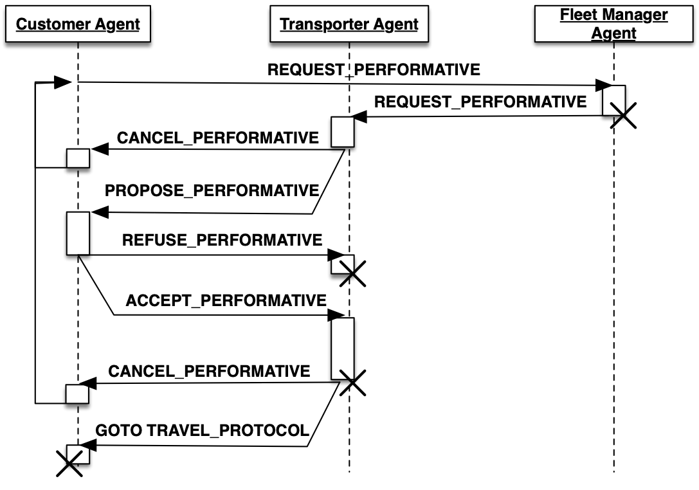
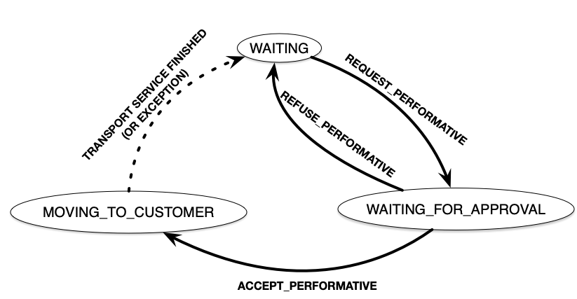
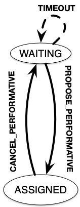
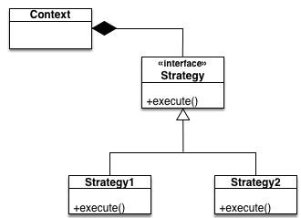
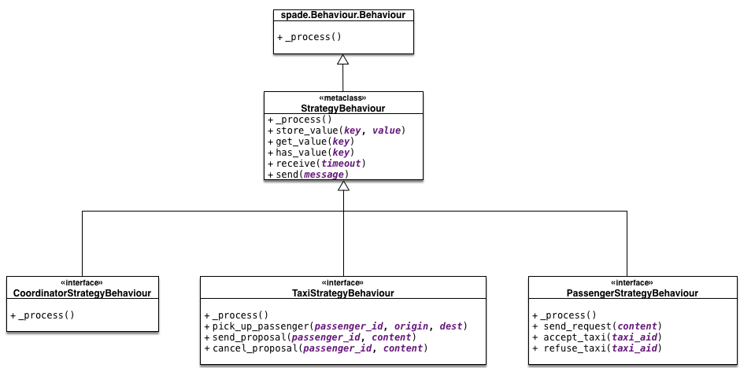

=========================
Developing New Strategies
=========================

.. contents:: Table of Contents

Introduction
============

One of the main features of "SimFleet" is the ability to change the default negotiation strategy of the agents that interact
during the simulation: the Fleet Manager agents, the Transport agents and the Customer agents. The overall goal of the negotiation
strategy of these three agent types is to decide which Transport agent will transport each Customer agent to its destination, making
sure that no Customer agent is left unattended. Additionally, the negotiation strategy may also try to optimize some metrics,
such as the average time that Customer agents are waiting to be served, or that the amount of gas spent by Transport in their movements.

The negotiation strategy is based on two main elements. First, it is based on the internal logic of each agent type
(FleetManager, Transport and Customer) and, in particular, on their respective *strategy behaviour*, which includes the
internal logic of each agent type regarding the negotiation process. And second, it is also based on the so-called `REQUEST`
protocol, which comprises the types of messages exchanged among the three agent types during the negotiation.
The following diagram presents the protocol in the typical FIPA format, where agents types are depicted as vertical lines
and the exchanged message types (or "performatives") in horizontal arrows:

This chapter introduces first the current, default strategy of each agent type (FleetManager, Transport and Customer) and
then explains how to introduce new strategies for any, or all, of them.

Fleet Manager Strategy Behaviour (`DelegateRequestBehaviour`)
-------------------------------------------------------------

The FleetManager Agent includes a single behaviour, which is its strategy behaviour, now described.
The goal of the stategy behaviour of the FleetManager Agent is basically to **receive** the "request" messages (`REQUEST_PERFORMATIVE`)
sent by the Customer agents that need a transport service and, for each request, selecting the Transport agent, or agents,
that may perform the service, and **forward** the request to them. A `REQUEST_PERFORMATIVE` message includes the following fields::

                "customer_id":  Id of the Customer agent that performs the request.
                "origin":       Current position of the Customer, where the Transport has to pick it up.
                "dest":         Destination of the Customer, where the Transport needs to transport it.

The particular set of Transport agents to which the request will be forwarded depends on the *allocation policy* of the FleetManager
Agent, which is part of the strategy. In the default strategy behaviour for the FleetManager agent (`DelegateRequestBehaviour`),
the allocation policy is the simplest posible: it forwards every incoming request to **all** the Transport agents that are
registered in its fleet,
regardless of their current statuses or any other consideration (such as, for example, the last time they performed a service,
or the distance between them and the Customer agent).

In the default strategy behaviour, the set of incoming messages that may be delivered to the FleetManager Agent is reduced
to the requests made by Customer agents, and the behaviour itself does not include multiple states. So, each incoming message
is processed in the same way, and leaves the behaviour in the same (unique) state.

Once each request has been forwarded to some (or all) the Transport agents, the goal of the FleetManager Agent for that request
is achieved. This is the starting point to the negotiation between the Customer that has issued the request and the
Transport agents that have received it, which is described in the following sections.

Transport Agents Behaviours
---------------------------

Transport agents incorporate two behaviours: the strategy behaviour and the moving behaviour, now described.

Strategy Behaviour (`AcceptAlwaysStrategyBehaviour`)
~~~~~~~~~~~~~~~~~~~~~~~~~~~~~~~~~~~~~~~~~~~~~~~~~~~~

The goal of the strategy behaviour of a Transport agent is to negotiate with Customer agents which are requesting a transport service
the conditions of the service offered by the Transport, in order to achieve an agreement with these Customer agents.
When an agreement is reached between a particular Customer and Transport agents, then the Transport agent picks up the
Customer agent and transport it to its destination (and starts the Moving behaviour, described below).

The currently implemented, default strategy behaviour is called `AcceptAlwaysStrategyBehaviour`, and has a direct
relation with the `REQUEST` protocol explained above. In particular, the behaviour can be thought of as a finite-state
machine with some different states specifying the statuses of the Transport agent regarding the strategy behaviour, and
some transitions between states, wich are triggered either by messages (of the `REQUEST` protocol) received by the
Transport agent, or by some other program conditions. This is depicted in the following diagram:

   States and transitions of the strategy behaviour of a Transport agent.

The semantics of each state are now described:

* `TRANSPORT_WAITING`: In this state, the Transport agent is available (free) and waiting for requests from Customer agents.
  While in this state, if it receives a request message (`REQUEST_PERFORMATIVE`) from a particular Customer agent,
  it will send the Customer a service proposal (`PROPOSE_PERFORMATIVE`) and it will change its state to
  `TRANSPORT_WAITING_FOR_APPROVAL`.

* `TRANSPORT_WAITING_FOR_APPROVAL`: In this state, the Transport agent is waiting for the response message from a Customer agent
  to which it has sent a service proposal message. While in this state, it may receive two alternative answers from
  the Customer agent: (1) the Customer refuses the service proposal (`REFUSE_PERFORMATIVE`), in which case the Transport
  changes its state back to `TRANSPORT_WAITING`; or (2) the Customer accepts the proposal (`ACCEPT_PERFORMATIVE`), in
  which case it will change to the state `TRANSPORT_MOVING_TO_CUSTOMER`.

* `TRANSPORT_MOVING_TO_CUSTOMER`: In this state, the Transport agent and the Customer agent have agreed to perform a transport
  service, and then the Transport agent starts to travel to the Customer location in order to pick it up. This is
  the final state of the negotiation between the Transport and a certain Customer agent. When the Transport agent arrives
  to the Customer's position, the Transport agent executes the helper function `pick_up_customer`, which automatically
  starts the so-called Moving behaviour in the Transport agent, described below. It also sends a message to the Travel
  behaviour of the Customer agent, which starts that behaviour (this is explained in the next section).

Moving Behaviour
~~~~~~~~~~~~~~~~
This behaviour makes the Transport agent to move to the current location of the Customer agent with which it has reached
an agreement to perform a transport service. After picking the Customer agent up, the Transport will then transport it to
its destination. During that travel, the behaviour informs the Customer agent of where the Transport is and what it is
doing (going to pick up the Customer, taking the Customer to its destination, reaching the destination, etc.). All
this is performed by sending the Customer agent some messages which belong of another, dedicated protocol
called `TRAVEL_PROTOCOL`.

Once the Transport reaches the Customer agent's destination and the Customer agent is informed about it, the state of
the Transport agent (of the strategy behaviour) is here changed to `TRANSPORT_WAITING`, indicating that it is now free,
and hence making the Transport agent available again to receiving new requests from other Customer agents.

.. warning::
  This behaviour is internal and automatic, and it is not intended to be modified while developing
  new negotiation strategies. The same applies to the `TRAVEL_PROTOCOL` protocol.

Customer Agents Behaviours
--------------------------

Customer agents incorporate two behaviours: the strategy behaviour and the travel behaviour, now described.

Strategy Behaviour
~~~~~~~~~~~~~~~~~~

In the course of the `REQUEST` protocol, the request of a transport service made by a Customer agent is answered
by one (or several) Transport agents, each of which offering the Customer their conditions to perform such service.
The goal of the strategy behaviour of a Customer agent is to select the best of these transport service proposals,
according to its needs and/or preferences (e.g., to be picked up faster, to get the nearest available transport,
to get the cheapest service, etc.).

The currently implemented default strategy behaviour is called `AcceptFirstRequestBehaviour`. As in the
strategy behaviour of the Transport agents above, here we can also consider the strategy as a finite-state machine related to
the messages (of the `REQUEST` protocol) received by the Customer agent, as depicted below:

   States and transitions of the strategy behaviour of a Customer agent.

The semantics of each state are now described:

* `CUSTOMER_WAITING`: In this state, the Customer agent requires a transport service and, periodically, sends a
  request for that service until one (or many) Transport agent proposals (`PROPOSE_PERFORMATIVE`) are received.
  When the Customer accepts a particular proposal (in the current implementation, always the first one it
  receives while in this state) then it communicates so to the proposing Transport agent, and changes its own status
  to `CUSTOMER_ASSIGNED`.

* `CUSTOMER_ASSIGNED`: In this state, the Customer agent has been assigned to a particular transport, and the transport service
  is being performed. The Customer side of the transport service is implemented by activating the Travel behaviour, described
  below, which is started by a message sent by the Transport agent (in its helper function `pick_up_customer`).
  If something goes wrong (for example, an exception is raised during the transport service) or the Transport agent voluntarily
  wants to cancel the service, then the Transport agent sends a `CANCEL_PERFORMATIVE` to the Customer agent, which
  would then change its status back to `CUSTOMER_WAITING`, initiating the request process again.

Travel Behaviour
~~~~~~~~~~~~~~~~

This behaviour is activated (in the Customer agent) when a Transport agent decides to pick up the Customer agent, by
means of a message sent by the Transport (inside the Transport agent's helper function `pick_up_customer`). This message,
as well as other messages sent by the Transport agent to this behaviour, belongs to a protocol called `TRAVEL_PROTOCOL`.

The messages of the `TRAVEL_PROTOCOL` drive the transitions between the different states of this behaviour, in
the same way that the `REQUEST_PROTOCOL` does for the strategy behaviour. In particular, the states of this behaviour
are: `CUSTOMER_IN_TRANSPORT`, when the Transport agent has reached the Customer agent's position and has picked it up; and
`CUSTOMER_IN_DEST`, when the Transport agent has reached the Customer agent's destination. This would be the final state
of the Customer agent.

.. warning::
  This behaviour is internal and automatic, and it is not intended to be modified while developing
  new negotiation strategies. The same applies to the `TRAVEL_PROTOCOL` protocol.

The Negotiation Process between Transport and Customer Agents
-------------------------------------------------------------

After separately explaining the strategy behaviour of Transport and Customer agents, this section tries to relate both behaviours.
This is important to understand how these two agent types interact with each other in order to coordinate and reach the overall
goals of the simulation.

In particular, there are three key aspects (embedded within the strategy behaviours) which influence the overall
coordination process implemented in the simulator, as now described:

* The conditions of a transport service proposal. The current implementation does not consider any special condition other
  than the Transport agent being free (available to perform the service). Some aspects that could be included in a transport proposal
  would be, for example, the current location of the transport, the proposed fare, the route to take the Customer agent to its
  destination, etc.

* The preferences of customers in order to select a particular transport proposal. In the current implementation, the
  Customer agents always accept the first proposal received from a Transport agent. In a more sophisticated negotiation,
  some internal goals/conditions of the Customer agent could be taken into account in order to select a "better" proposal.
  These might include, for example, the expected waiting time until the Transport agent arrives, the amount of money that
  the service is expected to cost, the brand of the Transport vehicle, etc.

* The possibility of a transport to voluntarily cancel an ongoing transport service after a proposal has been accepted by a customer.
  This may happen only before the customer has been picked up, that is, while the transport is moving from its initial position
  to the location where the customer is waiting for it. In the current implementation, a transport service cancellation can
  only be produced if some exception is raised while the service is being produced (for example, if the software calculating
  a route for the Transport agent fails to produce a valid route). Since new Customer (and maybe Transport) agents can appear at
  any time while the simulation is running, a voluntary cancellation of transport services could improve the overall
  transportation of customers throughout the simulation, allowing for a "dynamic reallocation" of customers
  to transports, even when transport services were already committed.

Agent Foundations
=================
The architecture of SimFleet is built on top of a multi-agent system platform called SPADE. Although it is not necessary to
build new agents in order to develop new coordination strategies (the simulator provides all the necessary agents), it
is interesting to know how they work and what methods they provide for the creation of coordination strategies.

Next we will present the SPADE platform and its main features. For more documentation you can visit their website
https://github.com/javipalanca/spade.

SPADE
-----
`SPADE` (Smart Python multi-Agent Development Environment) is a multi-agent system (MAS) platform based on the
`XMPP <http://www.xmpp.org>`_ technology and written in the `Python <http://www.python.org/>`_ programming language.
This technology offers by itself many features and facilities that ease the construction of MAS, such as an existing
communication channel, the concepts of users (agents) and servers (platforms) and an extensible communication protocol
based on XML.

Extensible Messaging and Presence Protocol (XMPP) is an open, XML-inspired protocol for near-real-time, extensible
instant messaging (IM) and presence information. The protocol is built to be open and free, asynchronous, decentralized,
secure, extensible and flexible. The latter two features allow XMPP not only to be an instant messaging protocol, but
also to be extended and used for many tasks and situations (`IoT <https://xmpp.org/uses/internet-of-things.html>`_,
`WebRTC <https://xmpp.org/uses/webrtc.html>`_, `social <https://xmpp.org/uses/social.html>`_, ...). SPADE itself uses
some XMPP extensions to provide extended features to its agents, such as remote procedure calls between agents
(`Jabber-RPC <https://xmpp.org/extensions/xep-0009.html>`_), file transfer
(`In-Band Bytestreams <https://xmpp.org/extensions/xep-0047.html>`_), an so on.

In order to fully understand how SPADE works, it is necessary to know how the agents are made up and how they
communicate. In the following sections we will summarize the SPADE agent model and its communication API.

Agent Model: Behaviours
~~~~~~~~~~~~~~~~~~~~~~
SPADE agents are threaded-based objects that can be run concurrently and that are connected to a SPADE platform, which
internally runs an XMPP server. Each agent must provide an ID and password in order to be allowed to connect to the platform.
The agent ID is called JID and has the form of an email: a user name string plus a "`@`" character plus the IP address
of the SPADE server to connect to (e.g. `my_agent@127.0.0.1`).

The internal components of the SPADE agents that provide their intelligence are the **Behaviours**. A behaviour is a task
that an agent can run using some pre-defined repeating pattern. For example, the most basic behaviour type (pattern) is the so-called
cyclic behaviour, which repeatedly executes the same method over and over again, indefinitely. This is the way to develop
typical behaviours that wait for a perception, reason about it and finally execute an action, and then wait for the next
perception.

The following example is a sample of an agent with a cyclic behaviour (``spade.behaviour.CyclicBehaviour`` type) that waits for
a perception from the keyboard input, reasons on it and executes an action, and continues to do so indefinitely until
the user presses Ctrl+C. In order to build a behaviour, you need to inherit from the type of behaviour you want
(in the case of this example, the cyclic behaviour is implemented in the class ``spade.behaviour.CyclicBehaviour``)
and overload the coroutine ``run`` where the body of the behaviour is implemented. If needed, you can also overload
the ``on_start`` and ``on_end`` coroutines in order to execute actions on the initialization or shutdown of a behaviour,
respectively.

.. code-block:: python

    import spade
    import datetime
    import time

    class MyAgent(spade.agent.Agent):
        class MyBehaviour(spade.behaviour.CyclicBehaviour):

            async def on_start(self):
                print("Initialization of behaviour")

            async def run(self):
                # wait for perception, raw_input is a blocking call
                perception = raw_input("What's your birthday year?")
                # reason about the perception
                age = datetime.datetime.now().year - perception
                # execute an action
                print("You are {age} years old.".format(age=age))

            async def on_end(self):
                print("Shutdown of behaviour")

        async def setup(self):
            # Create behaviour
            behaviour = self.MyBehaviour()
            # Register behaviour in agent
            self.add_behaviour(behaviour)

    if __name__ == "__main__":
        a = MyAgent(jid="agent@127.0.0.1", password="secret")
        a.start()
        while True:
            try:
                time.sleep(1)
            except KeyboardInterrupt:
                break
        a.stop()

Along with the cyclic repeating pattern (or type), SPADE also provides several other types of behaviours, such as
like one-shot behaviours, periodic behaviours, finite-state machine behaviours, etc. It is important to note that
SPADE agents can execute many behaviours simultaneously, from the same or different types.

Communication API, Messages and Templates
~~~~~~~~~~~~~~~~~~~~~~~~~~~~~~~~~~~~~~~~~
Communication is one of the cornerstones of any multi-agent system, and SPADE is no exception. Agents can send and receive
messages using a simple API, and more importantly, they can receive them in certain behaviours according to templates they can
define.

A ``spade.message.Message`` is the class that needs to be filled in order to send a message. A
Message may be filled with several pieces of information, but the most important fields are the receiver, the content, the
performative and the protocol. The receiver must be filled with a `jid` address , which is a string.
The content is the (string-based) body of the message. The performative and protocol both add semantic information to the
message in the context of a conversation: they are normally used to represent the action and the rules that determine
how the agents are going to communicate in a specific semantic context and they are represented as metadata.

.. tip::
    It is usually recommended to use a representation language for the content of the message. Although semantic
    languages like OWL or RDF are normally used for this purpose, in this simulator JSON is used instead, for the sake of
    simplicity.

All these fields have a getter and setter function. An example is shown next:

.. code-block:: python

    import spade

    msg = spade.message.Message()
    msg.to = "receiver_agent@127.0.0.1"
    msg.set_metadata("performative", "request")
    msg.set_metadata("protocol", "my_custom_protocol")
    msg.body = "{'a_key': 'a_value'}"

.. hint::
    Other metadata fields that can be filled in the message are the content language, the ontology, and so on.

The next step is to send the message. This is done with the ``send`` coroutine provided by a `Behaviour`.
For example:

.. code-block:: python

    import spade

    class SenderAgent(spade.agent.Agent):
        class SendBehav(spade.behaviour.OneShotBehaviour):

            async def run(self):
                msg = spade.message.Message()
                msg.to = "receiver@127.0.0.1"
                msg.set_metadata("performative", "inform")
                msg.set_metadata("ontology", "myOntology")
                msg.set_metadata("language", "OWL-S")
                msg.body = "Hello World"

                await self.send(msg)  # send the message

        async def setup(self):
            print "MyAgent starting..."
            behav = self.SendBehav()
            self.add_behaviour(behav)

The reception of messages is particular in SPADE, since messages can only be received by behaviours, and so
SPADE provides each behaviour executed by any agent with its own mailbox, and defines a mechanism in
order to configure the particular behaviour that must receive each message, according to the message type.
This mechanism is carried out with `Templates`. When an agent receives a new message it checks if the message matches each
of the behaviours using a template with which they where registered. If there is a match, the message is delivered to the
mailbox of the corresponding behaviour, and will be read when the behaviour executes the ``receive`` method. Otherwise,
the message will be dropped.

.. note::
    The ``receive`` coroutine accepts an optional parameter: **timeout=seconds**, which allows the coroutine to be
    blocking until the specified number of seconds have elapsed. If the timeout is reached without a message being
    received, then ``None`` is returned. If the timeout is set to 0, then the :func:`receive` function is non-blocking
    and (immediately) returns either a ``spade.message.Message`` or ``None``.

A ``spade.template.Template`` is created using the same API of ``spade.message.Message``:

.. code-block:: python

    import spade
    template = spade.template.Template()
    template.set_metadata("ontology", "myOntology")

.. note::
    A ``spade.template.Template`` accepts boolean operators to combine `Templates`
    (e.g. ``my_tpl = Template( template1 & template2)``)

At this point we can present a full example on how to build an agent that registers a behaviour with a template and receives messages
that match that template:

.. code-block:: python

    import spade
    import asyncio

    class RecvAgent(spade.agent.Agent):
        class ReceiveBehav(spade.behaviour.CyclicBehaviour):

            async def run(self):
                await msg = self.receive(timeout=10)

                # Check wether the message arrived
                if msg is not None:
                    assert "myOntology" == msg.get_metadata("ontology")
                    print("I got a message with the ontology 'myOntology'")
                else:
                    print("I waited 10 seconds but got no message")

        async def setup(self):
            recv_behav = self.ReceiveBehav()
            template = spade.template.Template()
            template.set_metadata("ontology", "myOntology")

            self.add_behaviour(recv_behav, template)

These are the basics of SPADE programming. You will not need to create all these structures, templates and classes
in order to use `SimFleet`, but it is always better to know the foundations before getting down to business.

How to Implement your own Strategies
====================================

SimFleet is designed for users to implement and test new strategies that lead to system optimization. The
goal of this simulator is to make it easier for users to work with new coordination strategies without
having to introduce major modifications to the application. For this purpose, SimFleet incorporates the so-called
Strategy design pattern, which is now introduced.

The Strategy Pattern
--------------------

The **Strategy Pattern** is a design pattern that enables selecting an algorithm at runtime. The Strategy Pattern is
the best practice when an application incorporates different, alternative versions of an algorithm and we want to be
able to select any of these versions to be executed at run time. With this pattern, you can define a separate
strategy (implementation of the algorithm) in an object that encapsulates the algorithm. The application that executes
the algorithm **must** define an interface that every strategy (implementation) will follow, as it can be seen in
the following figure:

    The Strategy Pattern UML.

Following this implementation, the context object can call the current strategy implementation without knowing how the
algorithm was implemented. This design pattern was created, among others, by a group of authors commonly known as the
**Gang of Four** (E. Gamma, R. Helm, R. Johnson and J. Vlissides), and it is well presented in [GangOfFour95]_.

SimFleet uses the *Strategy Pattern* in order to enable users to implement three different strategies (one for the
fleet manager agent, one for the transport agent and one for the customer agent) without having to develop new agents or
entering in the complexity of the simulator. Thanks to this pattern, users can develop their strategies in an external
file and pass it as an argument when the simulator is run.

SimFleet implements one interface for each of these three agents, with each interface also providing some helper
functions that intend to facilitate the most common actions of each (subclassed) agent. These three interfaces inherit
from the :class:`StrategyBehaviour` class and are called: :class:`FleetManagerStrategyBehaviour`,
:class:`TransportStrategyBehaviour` and :class:`CustomerStrategyBehaviour`.

    The StrategyBehaviour class and their inherited interfaces.

The Strategy Behaviour
----------------------

The :class:`StrategyBehaviour` is the metaclass from which interfaces are created for the strategies of each agent in
the simulator. It inherits from a ``spade.behaviour.CyclicBehaviour`` class, so when implementing it, you will have to
overload the ``run`` coroutine that will run cyclically (and endlessly), until the agent stops.

Helpers
~~~~~~~

The Strategy Behaviour provides also some helper functions that are useful in general for any kind of agent in the simulator.

.. danger::
    Don't store information in the Behaviour itself since it is a cyclic behaviour and is run by calling repeteadly the
    ``run`` coroutine, so the context of the function is not persistent. Use the agent variable that is accesible from
    any behaviour as `self.agent`. (i.e. you can do ``self.agent.set("my_key", "my_value")`` and ``self.agent.get("my_key")``.

The ``set`` and ``get`` functions allow to store persistent information in the
agent and to recover it at any moment. The store uses a *key-value* interface to store custom-defined data.

There is also a very useful helper function which is the **logger**. This is not a single function but a system of logs
which can be used to generate debug information at different levels. There are five levels of logging which are now
presented, in order of importance:

* **DEBUG**
    Used with ``logger.debug("my debug message")``. These messages are only shown when the simulator is
    called with the ``-v`` option. This is usually superfluous information.
* **INFO**
    Used with ``logger.info("my info message")``. These messages are always shown and are the regular
    information shown in logs.
* **WARNING**
    Used with ``logger.warn("my warning message")``. These messages are always shown and are used to
    show warnings to the user.
* **ERROR**
    Used with ``logger.error("my error message")``. These messages are always shown and are used to show
    errors to the user.
* **SUCCESS**
    Used with ``logger.success("my success message")``. These messages are always shown and are used to show
    success messages to the user.

In order to use this logger just remember to import the ``loguru`` library as follows:

.. code-block:: python

    from loguru import logger

Developing the FleetManager Agent Strategy
------------------------------------------

In order to develop a new strategy for the FleetManager Agent, you need to create a class that inherits from
``FleetManagerStrategyBehaviour``. Since this is a cyclic behaviour class that follows the *Strategy Pattern* and
that inherits from the ``StrategyBehaviour``, it has all the previously presented helper functions for
communication and storing data inside the agent.

Following the *REQUEST* protocol, the FleetManager agent is supposed to receive every request for a transport service
from customers and to carry out the action that your strategy determines (note that, in the default strategy
``DelegateRequestBehaviour``, the fleet manager delegates the decision to the transports themselves by redirecting all
requests to all their registered transports without any previous, additional reasoning).
The code of the ``DelegateRequestBehaviour`` is presented below.

The place in the code where your fleet manager strategy must be coded is the ``run`` coroutine. This
function is executed in an infinite loop until the agent stops. In addition, you may also overload the ``on_start``
and the ``on_end`` coroutines, in order to execute code before the creation of the strategy or after its destruction,
if needed.

Code
~~~~
This is the code of the default fleet manager strategy :class:`DelegateRequestBehaviour`:

.. code-block:: python

    from simfleet.fleetmanager import FleetManagerStrategyBehaviour

    async def run(self):
        if not self.agent.registration:
            # Register into Directory Agent to make your fleet public
            await self.send_registration()

        msg = await self.receive(timeout=5)
        logger.debug("Manager received message: {}".format(msg))
        if msg:
            # Redirect request to all your registered transports
            for transport in self.get_transport_agents().values():
                msg.to = str(transport["jid"])
                logger.debug("Manager sent request to transport {}".format(transport["name"]))
                await self.send(msg)

Helpers
~~~~~~~

The fleet manager agent incorporates two helper functions:

* ``send_registration``

    Registers its fleet in the Directory agent. This way customers can find their fleet and request for services.

* ``get_transport_agents``

    Returns a list of the transports that are registered in that fleet.

Developing the Transport Agent Strategy
---------------------------------------
To develop a new strategy for the Transport Agent, you need to create a class that inherits from
``TransportStrategyBehaviour``. Since this is a cyclic behaviour class that follows the *Strategy Pattern* and
that inherits from the ``StrategyBehaviour``, it has all the previously presented helper functions for
communication and storing data inside the agent.

The transport strategy is intended to receive requests from customers, forwarded by its fleet manager agent, and then to send
proposals to these customers in order to be selected by the corresponding customer. If a transport proposal is accepted,
then the transport begins the process of going to the customer's current position, picking the customer up, and taking the customer
to the requested destination.

.. warning::
    The process that implies a transport movement is out of the scope of the strategy and should not be addressed by the
    strategy implementation. This customer-transfer process is automatically triggered when the strategy executes the
    helper coroutine ``pick_up_customer`` (which is supposed to be the last action of a transport strategy).

The place in the code where your transport strategy must be coded is the ``run`` coroutine. This
function is executed in an infinite loop until the agent stops. In addition, you may also overload the ``on_start``
and the ``on_end`` coroutines, in order to execute code before the creation of the strategy or after its destruction,
if needed.

Code
~~~~
The default strategy of a transport is to accept any customers' request if the transport is not assigned to any other customer
or waiting a confirmation from any customer. This is the code of the default transport strategy ``AcceptAlwaysStrategyBehaviour``:

.. code-block:: python

    from simfleet.transport import TransportStrategyBehaviour

    class AcceptAlwaysStrategyBehaviour(TransportStrategyBehaviour):
        async def run(self):
            if self.agent.needs_charging():
                if self.agent.stations is None or len(self.agent.stations) < 1:
                    logger.warning("Transport {} looking for a station.".format(self.agent.name))
                    await self.send_get_stations()
                else:
                    station = random.choice(list(self.agent.stations.keys()))
                    logger.info("Transport {} reserving station {}.".format(self.agent.name, station))
                    await self.send_proposal(station)
                    self.agent.status = TRANSPORT_WAITING_FOR_STATION_APPROVAL

            msg = await self.receive(timeout=5)
            if not msg:
                return
            logger.debug("Transport received message: {}".format(msg))
            try:
                content = json.loads(msg.body)
            except TypeError:
                content = {}

            performative = msg.get_metadata("performative")
            protocol = msg.get_metadata("protocol")

            if protocol == QUERY_PROTOCOL:
                if performative == INFORM_PERFORMATIVE:
                    self.agent.stations = content
                    logger.info("Got list of current stations: {}".format(list(self.agent.stations.keys())))
                elif performative == CANCEL_PERFORMATIVE:
                    logger.info("Cancellation of request for stations information.")

            elif protocol == REQUEST_PROTOCOL:
                logger.debug("Transport {} received request protocol from customer/station.".format(self.agent.name))

                if performative == REQUEST_PERFORMATIVE:
                    if self.agent.status == TRANSPORT_WAITING:
                        if not self.has_enough_autonomy(content["origin"], content["dest"]):
                            await self.cancel_proposal(content["customer_id"])
                            self.agent.status = TRANSPORT_NEEDS_CHARGING
                        else:
                            await self.send_proposal(content["customer_id"], {})
                            self.agent.status = TRANSPORT_WAITING_FOR_APPROVAL

                elif performative == ACCEPT_PERFORMATIVE:
                    if self.agent.status == TRANSPORT_WAITING_FOR_APPROVAL:
                        logger.debug("Transport {} got accept from {}".format(self.agent.name,
                                                                              content["customer_id"]))
                        try:
                            self.agent.status = TRANSPORT_MOVING_TO_CUSTOMER
                            await self.pick_up_customer(content["customer_id"], content["origin"], content["dest"])
                        except PathRequestException:
                            logger.error("Transport {} could not get a path to customer {}. Cancelling..."
                                         .format(self.agent.name, content["customer_id"]))
                            self.agent.status = TRANSPORT_WAITING
                            await self.cancel_proposal(content["customer_id"])
                        except Exception as e:
                            logger.error("Unexpected error in transport {}: {}".format(self.agent.name, e))
                            await self.cancel_proposal(content["customer_id"])
                            self.agent.status = TRANSPORT_WAITING
                    else:
                        await self.cancel_proposal(content["customer_id"])

                elif performative == REFUSE_PERFORMATIVE:
                    logger.debug("Transport {} got refusal from customer/station".format(self.agent.name))
                    self.agent.status = TRANSPORT_WAITING

                elif performative == INFORM_PERFORMATIVE:
                    if self.agent.status == TRANSPORT_WAITING_FOR_STATION_APPROVAL:
                        logger.info("Transport {} got accept from station {}".format(self.agent.name,
                                                                                     content["station_id"]))
                        try:
                            self.agent.status = TRANSPORT_MOVING_TO_STATION
                            await self.send_confirmation_travel(content["station_id"])
                            await self.go_to_the_station(content["station_id"], content["dest"])
                        except PathRequestException:
                            logger.error("Transport {} could not get a path to station {}. Cancelling..."
                                         .format(self.agent.name, content["station_id"]))
                            self.agent.status = TRANSPORT_WAITING
                            await self.cancel_proposal(content["station_id"])
                        except Exception as e:
                            logger.error("Unexpected error in transport {}: {}".format(self.agent.name, e))
                            await self.cancel_proposal(content["station_id"])
                            self.agent.status = TRANSPORT_WAITING
                    elif self.agent.status == TRANSPORT_CHARGING:
                        if content["status"] == TRANSPORT_CHARGED:
                            self.agent.transport_charged()
                            await self.agent.drop_station()

                elif performative == CANCEL_PERFORMATIVE:
                    logger.info("Cancellation of request for {} information".format(self.agent.fleet_type))

Helpers
~~~~~~~

There are some helper coroutines that are specific for the transport strategy:

.. code-block:: python

            async def send_proposal(self, customer_id, content=None)
            async def cancel_proposal(self, customer_id, content=None)
            async def pick_up_customer(self, customer_id, origin, dest)

The definition and purpose of each of them is now introduced:

* ``send_proposal``

    This helper function simplifies the composition and sending of a message containing a proposal to a customer. It sends a
    ``Message`` to ``customer_id`` using the **REQUEST_PROTOCOL** and a **PROPOSE_PERFORMATIVE**. It optionally
    accepts a `content` parameter where you can include any additional information you may want the customer to analyze.

* ``cancel_proposal``

    This helper function simplifies the composition and sending of a message to a customer to cancel a proposal. It sends a
    ``Message`` to ``customer_id`` using the **REQUEST_PROTOCOL** and a **CANCEL_PERFORMATIVE**. It optionally
    accepts a `content` parameter where you can include any additional information you may want the customer to analyze.

* ``pick_up_customer``

    This helper function triggers the **TRAVEL_PROTOCOL** of a transport, which is the protocol that is used to transport a
    customer from her current position to her destination. This is a very important and particular function. Invoking
    this function is normally the last instruction of this strategy, since it means that the purpose of the strategy
    is accomplished (until the **TRAVEL_PROTOCOL** ends and the transport is again free and able to receive new requests
    from some other customers).

    The ``pick_up_customer`` helper receives as parameters the id of the customer and the coordinates of the
    customer's current position (``origin``) and its destination (``dest``).

Developing the Customer Agent Strategy
--------------------------------------

To develop a new strategy for the Customer Agent, you need to create a class that inherits from
``CustomerStrategyBehaviour``. Since this is a cyclic behaviour class that follows the *Strategy Pattern* and
that inherits from the ``StrategyBehaviour``, it has all the previously presented helper functions for
communication and storing data inside the agent.

The customer strategy is intended to ask a fleet manager agent for a transport service, then wait for transport proposals and, after
evaluating them, choosing a particular transport proposal which will take the customer to her destination.

The place in the code where your customer strategy must be coded is the ``run`` coroutine. This
function is executed in an infinite loop until the agent stops. In addition, you may also overload the ``on_start``
and the ``on_end`` coroutines, in order to execute code before the creation of the strategy or after its destruction,
if needed.

Code
~~~~
The default strategy of a Customer agent is a dummy strategy that simply accepts the first proposal it receives.
This is the code of the default customer strategy ``AcceptFirstRequestBehaviour``:

.. code-block:: python

    from simfleet.customer import CustomerStrategyBehaviour

    class AcceptFirstRequestTransportBehaviour(CustomerStrategyBehaviour):

        async def run(self):
            if self.agent.fleetmanagers is None:
                await self.send_get_managers(self.agent.fleet_type)

                msg = await self.receive(timeout=5)
                if msg:
                    performative = msg.get_metadata("performative")
                    if performative == INFORM_PERFORMATIVE:
                        self.agent.fleetmanagers = json.loads(msg.body)
                        return
                    elif performative == CANCEL_PERFORMATIVE:
                        logger.info("Cancellation of request for {} information".format(self.agent.type_service))
                        return

            if self.agent.status == CUSTOMER_WAITING:
                await self.send_request(content={})

            msg = await self.receive(timeout=5)

            if msg:
                performative = msg.get_metadata("performative")
                transport_id = msg.sender
                if performative == PROPOSE_PERFORMATIVE:
                    if self.agent.status == CUSTOMER_WAITING:
                        logger.debug(
                            "Customer {} received proposal from transport {}".format(self.agent.name, transport_id))
                        await self.accept_transport(transport_id)
                        self.agent.status = CUSTOMER_ASSIGNED
                    else:
                        await self.refuse_transport(transport_id)

                elif performative == CANCEL_PERFORMATIVE:
                    if self.agent.transport_assigned == str(transport_id):
                        logger.warning(
                            "Customer {} received a CANCEL from Transport {}.".format(self.agent.name, transport_id))
                        self.agent.status = CUSTOMER_WAITING

Helpers
~~~~~~~
There are some helper coroutines that are specific for the customer strategy:

.. code-block:: python

    async def send_get_managers(content=None)
    async def send_request(self, content=None)
    async def accept_transport(self, transport_aid)
    async def refuse_transport(self, transport_aid)

The definition and purpose of each of them is now introduced:

* ``send_get_managers``

    This helper makes a query to the Directory agent to find all the fleet managers that provide a fleet service of
    type `content`. Thus, you can filter those fleet managers that provide the transport service that you are looking for.
    It is expected for the user to store the response of this query in the ``self.agent.fleetmanagers`` variable as
    a dictionary. This variable will be used by the next helper.

* ``send_request``

    This helper is useful to make a new request without building the entire message (the function makes it for you).
    It creates a ``Message`` with a **REQUEST** performative and sends it to all the fleet manager agents stored in ``self.agent.fleetmanagers``.
    In addition, you can append a content to the request message to be used by the fleet manager agent or the transport agents (e.g. your origin
    coordinates or your destination coordinates).

* ``accept_transport``

    This is a helper function to send an acceptance message to a ``transport_id``. It sends a ``Message`` with an
    **ACCEPT** performative to the selected transport.

* ``refuse_transport``

    This is a helper function to refuse a proposal from a ``transport_id``. It sends a ``Message`` with an **REFUSE**
    performative to the transport whose proposal is being refused.

Other Helpers
-------------
SimFleet also includes a ``helpers`` module which provides some general support methods that may be useful
for any agent. These functions are now introduced:

* ``are_close``

    This helper function facilitates working with distances in maps. This helper function accepts two coordinates
    (``coord1`` and ``coord2``) and an optional parameter to set the tolerance in meters. It returns ``True`` if
    both coordinates are closer than the tolerance in meters (10 meters by default). Otherwise it returns ``False``.

    Example:

    .. code-block:: python

        assert are_close([39.253, -0.341], [39.351, -0.333], 1000) == True

* ``distance_in_meters``

    This helper function returns the distance in meters between two points.

    Example:

    .. code-block:: python

        assert distance_in_meters([-0.37565, 39.44447], [-0.40392, 39.45293]) == 3264.7134341427977

How to Implement New Strategies -- Recommendations
============================================================

At this point is time for you to implement your own strategies to optimize the problem of dispatching transports to customers.
In this chapter we have shown you the tools to create these strategies. You have to create a file (in this example we
are using ``my_strategy_file.py``) and develop the strategies to be tested following the next template:

.. code-block:: python

    from simfleet.fleetmanager import FleetManagerStrategyBehaviour
    from simfleet.customer import CustomerStrategyBehaviour
    from simfleet.transport import TransportStrategyBehaviour

    ################################################################
    #                                                              #
    #                     FleetManager Strategy                    #
    #                                                              #
    ################################################################
    class MyFleetManagerStrategy(FleetManagerStrategyBehaviour):
        async def run(self):
           # Your code here

    ################################################################
    #                                                              #
    #                         Transport Strategy                   #
    #                                                              #
    ################################################################
    class MyTransportStrategy(TransportStrategyBehaviour):
        async def run(self):
           # Your code here

    ################################################################
    #                                                              #
    #                       Customer Strategy                      #
    #                                                              #
    ################################################################
    class MyCustomerStrategy(CustomerStrategyBehaviour):
        async def run(self):
           # Your code here

In this file, three strategies have been created for the three types of agent handled by the simulator. We have called
these strategies ``MyFleetManagerStrategy``, ``MyTransportStrategy`` and ``MyCustomerStrategy``.

To run the simulator with your new strategies the configuration file accepts three parameters with the name of the
file (without extension) and the name of the class of each strategy.

.. code-block:: json

    {
        "fleets": [...],
        "transports": [...],
        "customers": [...],
        "stations": [...],
        "simulation_name": "My Config",
        "max_time": 1000,
        "transport_strategy": "my_strategy_file.MyTransportStrategy",
        "customer_strategy": "my_strategy_file.MyCustomerStrategy",
        "fleetmanager_strategy": "my_strategy_file.MyFleetManagerStrategy",
        ...
        "host": "localhost",
    }

.. code-block:: bash

 $ simfleet --config my_custom_simulation.json

.. warning::
    The file must be in the current working directory and it must be referenced *without* the extension (if the file is
    named ``my_strategy_file.py`` use ``my_strategy_file`` when calling the simulator.

Once run the simulator you can test your strategies using the graphical web interface or by inspecting the output of the
logs in the command line.

.. [GangOfFour95] E. Gamma, R. Helm, R. Johnson, and J. Vlissides. Design Patterns, Elements of Reusable Object Oriented Software. Addison-Wesley, 1995.

