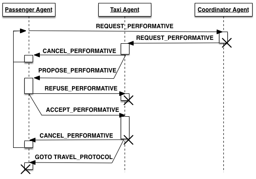
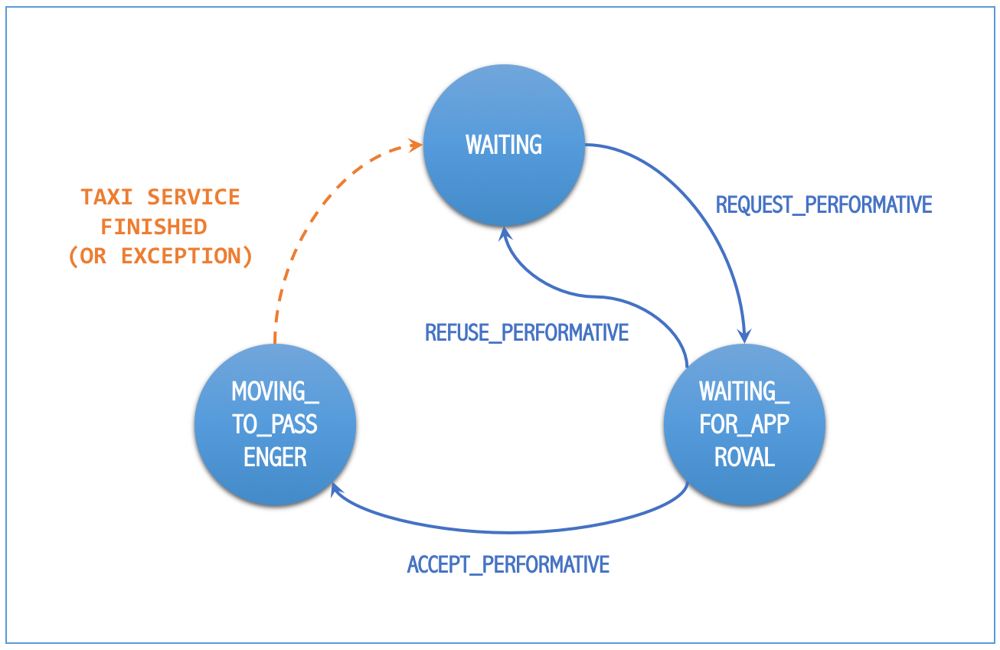

=========================
Developing New Strategies
=========================

.. contents:: Table of Contents

Introduction
============

One of the main features of "Taxi Simulator" is the ability to change the default negotiation strategy of the agents that interact
during the simulation: the Coordinator agent, the Taxi agents and the Passenger agents. The overall goal of the negotiation
strategy of these three agent types is to decide which Taxi agent will transport each Passenger agent to its destination, making
sure that no Passenger agent is left unattended. Additionally, the negotiation strategy may also try to optimize some metrics,
such as the average time that Passenger agents are waiting to be served, or that the amount of gas spent by Taxi in their movements.

The negotiation strategy is based on two main elements. First, it is based on the internal logic of each agent type
(Coordinator, Taxi and Passenger) and, in particular, on their respective *strategy behavior*, which includes the
internal logic of each agent type regarding the negotiation process. And second, it is also based on the so-called `REQUEST`
protocol, which comprises the types of messages exchanged among the three agent types during the negotiation.
The following diagram presents the protocol in the typical FIPA format, where agents types are depicted as vertical lines
and the exchanged message types (or "performatives") in horizontal arrows:

This chapter introduces first the current, default strategy of each agent type (Coordinator, Taxi and Passenger) and
then explains how to introduce new strategies for any, or all, of them.

Description of the Coordinator Agent
------------------------------------

The Coordinator Agent is responsible for putting in contact the Passenger agents that need a taxi service, and the Taxi
agents that may be available to offer these services. In short, the Coordinator Agent acts like a taxi call center, accepting
the incoming requests from customers (Passenger agents) and forwarding these requests to the (appropriate) Taxi agents.
In order to do so, the Coordinator agent knows the names and addresses of every Passenger and Taxi agent registered in
the system.

In the context of the Taxi Simulator, a "taxi service" involves, once a particular Passenger
and Taxi agents have reached an agreement, the movement of the Taxi agent from its current position to the Passenger's position in
order to pick the Passenger up, and then the transportation of the Passenger agent to its destination.

The Coordinator Agent includes a single behavior, which is its strategy behavior, now described.

Strategy Behaviour (`DelegateRequestTaxiBehaviour`)
~~~~~~~~~~~~~~~~~~~~~~~~~~~~~~~~~~~~~~~~~~~~~~~~~~~

The goal of the stategy behavior of the Coordinator Agent is basically to **receive** the "request" messages (`REQUEST_PERFORMATIVE`)
sent by the Passenger agents that need a taxi service and, for each request, selecting the Taxi agent, or agents,
that may perform the service,
and **forward** the request to them. A `REQUEST_PERFORMATIVE` message includes the following fields::

                "passenger_id": Id of the Passenger agent that performs the request.
                "origin":       Current position of the Passenger, where the Taxi has to pick it up.
                "dest":         Destination of the Passenger, where the Taxi needs to transport it.

The particular set of Taxi agents to which the request will be forwarded depends on the *allocation policy* of the Coordinator
Agent, which is part of the strategy. In the default strategy behavior for the Coordinator agent (`DelegateRequestTaxiBehaviour`),
the allocation policy is the simplest posible: it forwards every incoming request to **all** the Taxi agents,
regardless of their current statuses or any other consideration (such as, for example, the last time they performed a service,
or the distance between them and the Passenger agent).

In the default strategy behavior, the set of incoming messages that may be delivered to the Coordinator Agent is reduced
to the requests made by Passenger agents, and the behavior itself does not include multiple states. So, each incoming message
is processed in the same way, and leaves the behavior in the same (unique) state.

Once each request has been forwarded to some (or all) the Taxi agents, the goal of the Coordinator Agent for that request
is achieved. This is the starting point to the negotiation between the Passenger that has issued the request and the
Taxi agents that have received it, which is described in the following sections.

Description of the Taxi Agents
------------------------------

The Taxi agents represent vehicles which can transport Passenger agents from their current positions to their respective
destinations. In order to do that, Taxi agents incorporate two behaviors: the strategy behavior and the moving behavior,
now described.

Strategy Behaviour (`AcceptAlwaysStrategyBehaviour`)
~~~~~~~~~~~~~~~~~~~~~~~~~~~~~~~~~~~~~~~~~~~~~~~~~~~~

The goal of the strategy behavior of a Taxi agent is to negotiate with Passenger agents which are requesting a taxi service
the conditions of the service offered by the Taxi, in order to achieve an agreement with these Passenger agents.
When an agreement is reached between a particular Passenger and Taxi agents, then the Taxi agent picks up the
Passenger agent and transport it to its destination (and starts the Moving Behavior, described below).

The currently implemented, default strategy behavior is called `AcceptAlwaysStrategyBehaviour`, and has a direct
relation with the `REQUEST` protocol explained above. In particular, the behavior can be thought of as a finite-state
machine with some different states specifying the statuses of the Taxi agent regarding the strategy behavior, and
some transitions between states, wich are triggered either by messages (of the `REQUEST` protocol) received by the
Taxi agent, or by some other program conditions. This is depicted in the following diagram:

   States and transitions of the strategy behavior of a Taxi agent.

The semantics of each state are now described:

* `TAXI_WAITING`: In this state, the Taxi agent is available (free) and waiting for requests from Passenger agents.
  While in this state, if it receives a request message (`REQUEST_PERFORMATIVE`) from a particular Passenger agent,
  it will send the Passenger a service proposal (`PROPOSE_PERFORMATIVE`) and it will change its state to
  `TAXI_WAITING_FOR_APPROVAL`.

* `TAXI_WAITING_FOR_APPROVAL`: In this state, the Taxi agent is waiting for the response message from a Passenger agent
  to which it has sent a service proposal message. While in this state, it may receive two alternative answers from
  the Passenger agent: (1) the Passenger refuses the service proposal (`REFUSE_PERFORMATIVE`), in which case the Taxi
  changes its state back to `TAXI_WAITING`; or (2) the Passenger accepts the proposal (`ACCEPT_PERFORMATIVE`), in
  which case it will change to the state `TAXI_MOVING_TO_PASSENGER`.

* `TAXI_MOVING_TO_PASSENGER`: In this state, the Taxi agent and the Passenger agent have agreed to perform a taxi
  service, and then the Taxi agent starts to travel to the Passenger location in order to pick it up. This is
  the final state of the negotiation between the Taxi and a certain Passenger agent. In this state, the Taxi agent
  executes the helper function `pick_up_passenger`, which automatically starts the so-called Moving Behavior
  in the Taxi agent, described below. It also sends a message to the Travel Behavior of the Passenger agent, which
  starts that behavior (this is explained in the next section).

Moving Behaviour
~~~~~~~~~~~~~~~~
This behavior makes the Taxi agent to move to the current location of the Passenger agent with which it has reached
an agreement to perform a taxi service. After picking the Passenger agent up, the Taxi will then transport it to
its destination. During that travel, the behavior informs the Passenger agent of where the Taxi is and what it is
doing (going to pick up the Passenger, taking the Passenger to its destination, reaching the destination, etc.). All
this is performed by sending the Passenger agent some messages which belong of another, dedicated protocol
called `TRAVEL_PROTOCOL`.

Once the Taxi reaches the Passenger agent's destination and the Passenger agent is informed about it, the state of
the Taxi agent (of the strategy behavior) is here changed to `TAXI_WAITING`, indicating that it is now free,
and hence making the Taxi agent available again to receiving new requests from other Passenger agents.

.. warning::
  This behavior is internal and automatic, and it is not intended to be modified while developing
  new negotiation strategies. The same applies to the `TRAVEL_PROTOCOL` protocol.

Description of the Passenger Agents
-----------------------------------

The Passenger agents represent people that need to go from one location of the city (their "current location") to
another (their "destination"), and for doing so, they request a taxi service. Each Passenger agent requires a single
taxi service and so, once transported to its destination, it reaches its final state and ends its execution. During
that execution, Passenger agents incorporate two behaviors: the strategy behavior and the travel behavior, now described.

Strategy Behaviour
~~~~~~~~~~~~~~~~~~

In the course of the `REQUEST` protocol, the request of a taxi service made by a Passenger agent is answered
by one (or several) Taxi agents, each of which offering the Passenger their conditions to perform such service.
The goal of the strategy behavior of a Passenger agent is to select the best of these taxi service proposals,
according to its needs and/or preferences (e.g., to be picked up faster, to get the nearest available taxi,
to get the cheapest service, etc.).

The currently implemented, default strategy behavior is called `AcceptFirstRequestTaxiBehaviour`. As in the
strategy behavior of the Taxi agents above, here we can also consider the strategy as a finite-state machine related to
the messages (of the `REQUEST` protocol) received by the Passenger agent, as depicted below:

.. figure:: images/Passenger_FSM.png
   :scale: 40 %
   :align: center

   States and transitions of the strategy behavior of a Passenger agent.

The semantics of each state are now described:

* `PASSENGER_WAITING`: In this state, the Passenger agent requires a taxi service and, periodically, sends a
  request for that service until one (or many) Taxi agent proposals (`PROPOSE_PERFORMATIVE`) are received.
  When the Passenger accepts a particular proposal (in the current implementation, always the first one it
  receives while in this state) then it communicates so to the proposing Taxi agent, and changes its own status
  to `PASSENGER_ASSIGNED`.

* `PASSENGER_ASSIGNED`: In this state, the Passenger agent has been assigned to a particular taxi, and the taxi service
  is being produced. The Passenger side of the taxi service is implemented by activating the Travel Behavior, described
  below, which is started by a message sent by the Taxi agent (in its helper function `pick_up_passenger`).
  If something goes wrong (for example, an exception is raised during the taxi service) or the Taxi agent voluntarily
  wants to cancel the service, then the Taxi agent sends a `CANCEL_PERFORMATIVE` to the Passenger agent, which
  would then change its status back to `PASSENGER_WAITING`, initiating the request process again.

Travel Behaviour
~~~~~~~~~~~~~~~~

This behavior is activated (in the Passenger agent) when a Taxi agent decides to pick up the Passenger agent, by
means of a message sent by the Taxi (inside the Taxi agent's helper function `pick_up_passenger`). This message,
as well as other messages sent by the Taxi agent to this behavior, belongs to a protocol called the `TRAVEL_PROTOCOL`.

The messages of the `TRAVEL_PROTOCOL` drive the transitions between the different states of this behavior, in
the same way that the `REQUEST_PROTOCOL` does for the strategy behavior. In particular, the states of this behavior
are: `PASSENGER_IN_TAXI`, when the Taxi agent has reached the Passenger agent's position and has picked it up; and
`PASSENGER_IN_DEST`, when the Taxi agent has reached the Passenger agent's destination. This would be the final state
of the Passenger agent.

.. warning::
  This behavior is internal and automatic, and it is not intended to be modified while developing
  new negotiation strategies. The same applies to the `TRAVEL_PROTOCOL` protocol.

The Negotiation Process between Taxi and Passenger Agents
---------------------------------------------------------

After separately explaining the strategy behavior of Taxi and Passenger agents, this section tries to relate both behaviors.
This is important to understand how these two agent types interact with each other in order to coordinate and reach the overall
goals of the simulation.

In particular, there are three key aspects (embedded within the strategy behaviors) which influence the overall
coordination process implemented in the simulator, as now described:

* The conditions of a taxi service proposal. The current implementation does not consider any special condition other
  than the Taxi agent being free (available to perform the service). Some aspects that could be included in a taxi proposal
  would be, for example, the current location of the taxi, the proposed fare, the route to take the Passenger agent to its
  destination, etc.

* The preferences of passengers in order to select a particular taxi proposal. In the current implementation, the
  Passenger agents always accept the first proposal received from a Taxi agent. In a more sophisticated negotiation,
  some internal goals/conditions of the Passenger agent could be taken into account in order to select a "better" proposal.
  These might include, for example, the expected waiting time until the Taxi agent arrives, the amount of money that
  the service is expected to cost, the brand of the Taxi vehicle, etc.

* The possibility of a taxi to voluntarily cancel an ongoing taxi service after a proposal has been accepted by a passenger.
  This may happen only before the pasenger has been picked up, that is, while the taxi is moving from its initial position
  to the location where the passenger is waiting for it. In the current implementation, a taxi service cancellation can
  only be produced if some exception is raised while the service is being produced (for example, if the software calculating
  a route for the Taxi agent fails to produce a valid route). Since new Passenger (and maybe Taxi) agents can appear at
  any time while the simulation is running, a voluntary cancellation of taxi services could improve the overall
  transportation of passengers throughout the simulation, allowing for a "dynamic reallocation" of passengers
  to taxis, even when taxi services where already committed.

Agent Foundations
=================
The architecture of Taxi Simulator is built on top of a multi-agent system platform called SPADE. Although it is not necessary to
build new agents in order to develop new coordination strategies (the simulator provides all the necessary agents), it
is interesting to know how they work and what methods they provide for the creation of coordination strategies.

Next we will present the SPADE platform and its main features. For more documentation you can visit their website
https://github.com/javipalanca/spade.

SPADE
-----
`SPADE` (Smart Python multi-Agent Development Environment) is a multi-agent system (MAS) platform based on the
`XMPP <http://www.xmpp.org>`_ technology and written in the `Python <http://www.python.org/>`_ programming language.
This technology offers by itself many features and facilities that ease the construction of MAS, such as an existing
communication channel, the concepts of users (agents) and servers (platforms) and an extensible communication protocol
based on XML.

Extensible Messaging and Presence Protocol (XMPP) is an open, XML-inspired protocol for near-real-time, extensible
instant messaging (IM) and presence information. The protocol is built to be open and free, asynchronous, decentralized,
secure, extensible and flexible. The latter two features allow XMPP not only to be an instant messaging protocol, but
also to be extended and used for many tasks and situations (`IoT <https://xmpp.org/uses/internet-of-things.html>`_,
`WebRTC <https://xmpp.org/uses/webrtc.html>`_, `social <https://xmpp.org/uses/social.html>`_, ...). SPADE itself uses
some XMPP extensions to provide extended features to its agents, such as remote procedure calls between agents
(`Jabber-RPC <https://xmpp.org/extensions/xep-0009.html>`_), file transfer
(`In-Band Bytestreams <https://xmpp.org/extensions/xep-0047.html>`_), an so on.

In order to fully understand how SPADE works, it is necessary to know how the agents are made up and how they
communicate. In the following sections we will summarize the SPADE agent model and its communication API.

Agent Model: Behaviors
~~~~~~~~~~~~~~~~~~~~~~
SPADE agents are threaded-based objects that can be run concurrently and that are connected to a SPADE platform, which
internally runs an XMPP server. Each agent must provide an ID and password in order to be allowed to connect to the platform.
The agent ID is called JID and has the form of an email: a user name string plus a "`@`" character plus the IP address
of the SPADE server to connect to (e.g. `my_agent@127.0.0.1`).

The internal components of the SPADE agents that provide their intelligence are the **Behaviors**. A behavior is a task
that an agent can run using some pre-defined repeating pattern. For example, the most basic behavior type (pattern) is the so-called
cyclic behavior, which repeatedly executes the same method over and over again, indefinitely. This is the way to develop
typical behaviors that wait for a perception, reason about it and finally execute an action, and then wait for the next
perception.

The following example is a sample of an agent with a cyclic behavior (``spade.behaviour.CyclicBehaviour`` type) that waits for
a perception from the keyboard input, reasons on it and executes an action, and continues to do so indefinitely until
the user presses Ctrl+C. In order to build a behavior, you need to inherit from the type of behavior you want
(in the case of this example, the cyclic behaviour is implemented in the class ``spade.behaviour.CyclicBehaviour``)
and overload the coroutine ``run`` where the body of the behavior is implemented. If needed, you can also overload
the ``on_start`` and ``on_end`` coroutines in order to execute actions on the initialization or shutdown of a behavior,
respectively.

.. code-block:: python

    import spade
    import datetime
    import time

    class MyAgent(spade.agent.Agent):
        class MyBehaviour(spade.behaviour.CyclicBehaviour):

            async def on_start(self):
                print("Initialization of behavior")

            async def run(self):
                # wait for perception, raw_input is a blocking call
                perception = raw_input("What's your birthday year?")
                # reason about the perception
                age = datetime.datetime.now().year - perception
                # execute an action
                print("You are {age} years old.".format(age=age))

            async def on_end(self):
                print("Shutdown of behavior")

        def setup(self):
            # Create behavior
            behaviour = self.MyBehaviour()
            # Register behavior in agent
            self.add_behaviour(behaviour)

    if __name__ == "__main__":
        a = MyAgent(jid="agent@127.0.0.1", password="secret")
        a.start()
        while True:
            try:
                time.sleep(1)
            except KeyboardInterrupt:
                break
        a.stop()

Along with the cyclic repeating pattern (or type), SPADE also provides several other types of behaviors, such as
like one-shot behaviors, periodic behaviors, finite-state machine behaviors, etc. It is important to note that
SPADE agents can execute many behaviors simultaneously, from the same or different types.

Communication API, Messages and Templates
~~~~~~~~~~~~~~~~~~~~~~~~~~~~~~~~~~~~~~~~~
Communication is one of the cornerstones of any multi-agent system, and SPADE is no exception. Agents can send and receive
messages using a simple API, and more importantly, they can receive them in certain behaviors according to templates they can
define.

A ``spade.message.Message`` is the class that needs to be filled in order to send a message. A
Message may be filled with several pieces of information, but the most important fields are the receiver, the content, the
performative and the protocol. The receiver must be filled with a `jid` address , which is a string.
The content is the (string-based) body of the message. The performative and protocol both add semantic information to the
message in the context of a conversation: they are normally used to represent the action and the rules that determine
how the agents are going to communicate in a specific semantic context and they are represented as metadata.

.. tip::
    It is usually recommended to use a representation language for the content of the message. Although semantic
    languages like OWL or RDF are normally used for this purpose, in this simulator JSON is used instead, for the sake of
    simplicity.

All these fields have a getter and setter function. An example is shown next:

.. code-block:: python

    import spade

    msg = spade.message.Message()
    msg.to = "receiver_agent@127.0.0.1"
    msg.set_metadata("performative", "request")
    msg.set_metadata("protocol", "my_custom_protocol")
    msg.body = "{'a_key': 'a_value'}"

.. hint::
    Other metadata fields that can be filled in the message are the content language, the ontology, and so on.

The next step is to send the message. This is done with the ``send`` coroutine provided by a `Behaviour`.
For example:

.. code-block:: python

    import spade

    class SenderAgent(spade.agent.Agent):
        class SendBehav(spade.behaviour.OneShotBehaviour):

            async def run(self):
                msg = spade.message.Message()
                msg.to = "receiver@127.0.0.1"
                msg.set_metadata("performative", "inform")
                msg.set_metadata("ontology", "myOntology")
                msg.set_metadata("language", "OWL-S")
                msg.body = "Hello World"

                await self.send(msg)  # send the message

        def setup(self):
            print "MyAgent starting..."
            behav = self.SendBehav()
            self.add_behaviour(behav)

The reception of messages is particular in SPADE, since messages can only be received by behaviors, and so
SPADE provides each behavior executed by any agent with its own mailbox, and defines a mechanism in
order to configure the particular behavior that must receive each message, according to the message type.
This mechanism is carried out with `Templates`. When an agent receives a new message it checks if the message matches each
of the behaviors using a template with which they where registered. If there is a match, the message is delivered to the
mailbox of the corresponding behavior, and will be read when the behavior executes the ``receive`` method. Otherwise,
the message will be dropped.

.. note::
    The ``receive`` coroutine accepts an optional parameter: **timeout=seconds**, which allows the coroutine to be
    blocking until the specified number of seconds have elapsed. If the timeout is reached without a message being
    received, then ``None`` is returned. If the timeout is set to 0, then the :func:`receive` function is non-blocking
    and (immediately) returns either a ``spade.message.Message`` or ``None``.

A ``spade.template.Template`` is created using the same API of ``spade.message.Message``:

.. code-block:: python

    import spade
    template = spade.template.Template()
    template.set_metadata("ontology", "myOntology")

.. note::
    A ``spade.template.Template`` accepts boolean operators to combine `Templates`
    (e.g. ``my_tpl = Template( template1 & template2)``)

At this point we can present a full example on how to build an agent that registers a behavior with a template and receives messages
that match that template:

.. code-block:: python

    import spade
    import asyncio

    class RecvAgent(spade.agent.Agent):
        class ReceiveBehav(spade.behaviour.CyclicBehaviour):

            async def run(self):
                await msg = self.receive(timeout=10)

                # Check wether the message arrived
                if msg is not None:
                    assert "myOntology" == msg.get_metadata("ontology")
                    print("I got a message with the ontology 'myOntology'")
                else:
                    print("I waited 10 seconds but got no message")

        def setup(self):
            recv_behav = self.ReceiveBehav()
            template = spade.template.Template()
            template.set_metadata("ontology", "myOntology")

            self.add_behaviour(recv_behav, template)

These are the basics of SPADE programming. You will not need to create all these structures, templates and classes
in order to use `Taxi Simulator`, but it is always better to know the foundations before getting down to business.

How to Implement your own Strategies
====================================

Taxi simulator is designed for students to implement and test new strategies that lead to system optimization. The
goal of this educational simulator is to make it easier for students to work with new coordination strategies without
having to introduce major modifications to the application. For this purpose, Taxi Simulator incorporates the so-called
Strategy design pattern, which is now introduced.

The Strategy Pattern
--------------------

The **Strategy Pattern** is a design pattern that enables selecting an algorithm at runtime. The Strategy Pattern is
the best practice when an application incorporates different, alternative versions of an algorithm and we want to be
able to select any of these versions to be executed at run time. With this pattern, you can define a separate
strategy (implementation of the algorithm) in an object that encapsulates the algorithm. The application that executes
the algorithm **must** define an interface that every strategy (implementation) will follow, as it can be seen in
the following figure:

.. figure:: images/strategy.png
    :align: center
    :alt: The Strategy Pattern UML

    The Strategy Pattern UML.

Following this implementation, the context object can call the current strategy implementation without knowing how the
algorithm was implemented. This design pattern was created, among others, by a group of authors commonly known as the
**Gang of Four** (E. Gamma, R. Helm, R. Johnson and J. Vlissides), and it is well presented in [GangOfFour95]_.

Taxi Simulator uses the *Strategy Pattern* in order to enable students to implement three different strategies (one for the
coordinator agent, one for the taxi agent and one for the passenger agent) without having to develop new agents or
entering in the complexity of the simulator. Thanks to this pattern, students can develop their strategies in an external
file and pass it as an argument when the simulator is run.

Taxi Simulator implements one interface for each of these three agents, with each interface also providing some helper
functions that intend to facilitate the most common actions of each (subclassed) agent. These three interfaces inherit
from the :class:`StrategyBehaviour` class and are called: :class:`CoordinatorStrategyBehaviour`,
:class:`TaxiStrategyBehaviour` and :class:`PassengerStrategyBehaviour`.

.. figure:: images/strategybehavior.png
    :align: center
    :alt: The StrategyBehaviour class and their inherited interfaces

    The StrategyBehaviour class and their inherited interfaces.

The Strategy Behaviour
----------------------

The :class:`StrategyBehaviour` is the metaclass from which interfaces are created for the strategies of each agent in
the simulator. It inherits from a ``spade.behaviour.CyclicBehaviour`` class, so when implementing it, you will have to
overload the ``run`` coroutine that will run cyclically (and endlessly), until the agent stops.

Helpers
~~~~~~~

The Strategy Behaviour provides also some helper functions that are useful in general for any kind of agent in the simulator.

.. danger::
    Don't store information in the Behaviour itself since it is a cyclic behaviour and is run by calling repeteadly the
    ``run`` coroutine, so the context of the function is not persistent. Use the agent variable that is accesible from
    any behaviour as `self.agent`. (i.e. you can do ``self.agent.set("my_key", "my_value")`` and ``self.agent.get("my_key")``.

The ``set`` and ``get`` functions allow to store persistent information in the
agent and to recover it at any moment. The store uses a *key-value* interface to store custom-defined data.

There is also a very useful helper function which is the **logger**. This is not a single function but a system of logs
which can be used to generate debug information at different levels. There are four levels of logging which are now
presented, in order of importance:

* **DEBUG**
    Used with ``self.logger.debug("my debug message")``. These messages are only shown when the simulator is
    called with the ``-v`` option. This is usually superfluous information.
* **INFO**
    Used with ``self.logger.info("my info message")``. These messages are always shown and are the regular
    information shown in logs.
* **WARNING**
    Used with ``self.logger.warn("my warning message")``. These messages are always shown and are used to
    show warnings to the user.
* **ERROR**
    Used with ``self.logger.error("my error message")``. These messages are always shown are are used to show
    errors to the user.

Developing the Coordinator Agent Strategy
-----------------------------------------

In order to develop a new strategy for the Coordinator Agent, you need to create a class that inherits from
``CoordinatorStrategyBehaviour``. Since this is a cyclic behaviour class that follows the *Strategy Pattern* and
that inherits from the ``StrategyBehaviour``, it has all the previously presented helper functions for
communication and storing data inside the agent.

Following the *REQUEST* protocol, the Coordinator agent is supposed to receive every request for a taxi service
from passengers and to carry out the action that your strategy determines (note that, in the default strategy
``DelegateRequestTaxiBehaviour``, the coordinator delegates the decision to the taxis themselves by redirecting all
requests to all taxis without any previous, additional reasoning). The code of the ``DelegateRequestTaxiBehaviour``
is presented below.

The place in the code where your coordinator strategy must be coded is the ``run`` coroutine. This
function is executed in an infinite loop until the agent stops. In addition, you may also overload the ``on_start``
and the ``on_end`` coroutines, in order to execute code before the creation of the strategy or after its destruction,
if needed.

Code
~~~~
This is the code of the default coordinator strategy :class:`DelegateRequestTaxiBehaviour`:

.. code-block:: python

    from taxi_simulator.coordinator import CoordinatorStrategyBehaviour

    class DelegateRequestTaxiBehaviour(CoordinatorStrategyBehaviour):

        async def run(self):
            msg = await self.receive(timeout=5)
            if msg:
                for taxi in self.get_taxi_agents():
                    msg.to = str(taxi.jid)
                    self.logger.debug("Coordinator sent request to taxi {}".format(taxi.name))
                    await self.send(msg)

Helpers
~~~~~~~

The coordinator agent incorporates two helper functions that allow the agent to recover a list of
all the taxi agents and passenger agents registered in the system. These functions are:

* ``get_taxi_agents``

    Returns a list of the taxi agents.

* ``get_passenger_agents``

    Returns a list of the passenger agents.

Developing the Taxi Agent Strategy
----------------------------------
To develop a new strategy for the Taxi Agent, you need to create a class that inherits from
``TaxiStrategyBehaviour``. Since this is a cyclic behaviour class that follows the *Strategy Pattern* and
that inherits from the ``StrategyBehaviour``, it has all the previously presented helper functions for
communication and storing data inside the agent.

The taxi strategy is intended to receive requests from passengers, forwarded by the coordinator agent, and then to send
proposals to these passengers in order to be selected by the corresponding passenger. If a taxi proposal is accepted,
then the taxi begins the process of going to the passenger's current position, picking the passenger up, and taking the passenger
to the requested destination.

.. warning::
    The process that implies a taxi movement is out of the scope of the strategy and should not be addressed by the
    strategy implementation. This pasenger-transfer process is automatically triggered when the strategy executes the
    helper coroutine ``pick_up_passenger`` (which is supposed to be the last action of a taxi strategy).

The place in the code where your coordinator strategy must be coded is the ``run`` coroutine. This
function is executed in an infinite loop until the agent stops. In addition, you may also overload the ``on_start``
and the ``on_end`` coroutines, in order to execute code before the creation of the strategy or after its destruction,
if needed.

Code
~~~~
The default strategy of a taxi is to accept every passenger's requests if the taxi is not assigned to any other passenger
or waiting a confirmation from any passenger. This is the code of the default taxi strategy ``AcceptAlwaysStrategyBehaviour``:

.. code-block:: python

    from taxi_simulator.taxi import TaxiStrategyBehaviour

    class AcceptAlwaysStrategyBehaviour(TaxiStrategyBehaviour):

        async def run(self):
            msg = await self.receive(timeout=5)
            if not msg:
                return
            self.logger.info("Taxi received message: {}".format(msg))
            content = json.loads(msg.body)
            performative = msg.get_metadata("performative")

            self.logger.debug("Taxi {} received request protocol from passenger {}.".format(self.agent.name,
                                                                                            content["passenger_id"]))
            if performative == REQUEST_PERFORMATIVE:
                if self.agent.status == TAXI_WAITING:
                    await self.send_proposal(content["passenger_id"], {})
                    self.agent.status = TAXI_WAITING_FOR_APPROVAL

            elif performative == ACCEPT_PERFORMATIVE:
                if self.agent.status == TAXI_WAITING_FOR_APPROVAL:
                    self.logger.debug("Taxi {} got accept from {}".format(self.agent.name,
                                                                          content["passenger_id"]))
                    try:
                        self.agent.status = TAXI_MOVING_TO_PASSENGER
                        await self.pick_up_passenger(content["passenger_id"], content["origin"], content["dest"])
                    except PathRequestException:
                        self.logger.error("Taxi {} could not get a path to passenger {}. Cancelling..."
                                          .format(self.agent.name, content["passenger_id"]))
                        self.agent.status = TAXI_WAITING
                        await self.cancel_proposal(content["passenger_id"])
                    except Exception as e:
                        self.logger.error("Unexpected error in taxi {}: {}".format(self.agent.name, e))
                        await self.cancel_proposal(content["passenger_id"])
                        self.agent.status = TAXI_WAITING
                else:
                    await self.cancel_proposal(content["passenger_id"])

            elif performative == REFUSE_PERFORMATIVE:
                self.logger.debug("Taxi {} got refusal from {}".format(self.agent.name,
                                                                       content["passenger_id"]))
                if self.agent.status == TAXI_WAITING_FOR_APPROVAL:
                    self.agent.status = TAXI_WAITING

Helpers
~~~~~~~

There are some helper coroutines that are specific for the taxi strategy:

.. code-block:: python

            async def send_proposal(self, passenger_id, content=None)
            async def cancel_proposal(self, passenger_id, content=None)
            async def pick_up_passenger(self, passenger_id, origin, dest)

The definition and purpose of each of them is now introduced:

* ``send_proposal``

    This helper function simplifies the composition and sending of a message containing a proposal to a passenger. It sends a
    ``Message`` to ``passenger_id`` using the **REQUEST_PROTOCOL** and a **PROPOSE_PERFORMATIVE**. It optionally
    accepts a `content` parameter where you can include any additional information you may want the passenger to analyze.

* ``cancel_proposal``

    This helper function simplifies the composition and sending of a message to a passenger to cancel a proposal. It sends a
    ``Message`` to ``passenger_id`` using the **REQUEST_PROTOCOL** and a **CANCEL_PERFORMATIVE**. It optionally
    accepts a `content` parameter where you can include any additional information you may want the passenger to analyze.

* ``pick_up_passenger``

    This helper function triggers the **TRAVEL_PROTOCOL** of a taxi, which is the protocol that is used to transport a
    passenger from her current position to her destination. This is a very important and particular function. Invoking
    this function is normally the last instruction of this strategy, since it means that the purpose of the strategy
    is accomplished (until the **TRAVEL_PROTOCOL** ends and the taxi is again free and able to receive new requests
    from some other passengers).

    The ``pick_up_passenger`` helper receives as parameters the id of the passenger and the coordinates of the
    passenger's current position (``origin``) and its destination (``dest``).

Developing the Passenger Agent Strategy
---------------------------------------

To develop a new strategy for the Passenger Agent, you need to create a class that inherits from
``PassengerStrategyBehaviour``. Since this is a cyclic behaviour class that follows the *Strategy Pattern* and
that inherits from the ``StrategyBehaviour``, it has all the previously presented helper functions for
communication and storing data inside the agent.

The passenger strategy is intended to ask the coordinator agent for a taxi service, then wait for taxi proposals and, after
evaluating them, choosing a particular taxi proposal which will take the passenger to her destination.

The place in the code where your coordinator strategy must be coded is the ``run`` coroutine. This
function is executed in an infinite loop until the agent stops. In addition, you may also overload the ``on_start``
and the ``on_end`` coroutines, in order to execute code before the creation of the strategy or after its destruction,
if needed.

Code
~~~~
The default strategy of a Passenger agent is a dummy strategy that simply accepts the first proposal it receives.
This is the code of the default passenger strategy ``AcceptFirstRequestTaxiBehaviour``:

.. code-block:: python

    from taxi_simulator.passenger import PassengerStrategyBehaviour

    class AcceptFirstRequestTaxiBehaviour(PassengerStrategyBehaviour):

        async def run(self):
            if self.agent.status == PASSENGER_WAITING:
                await self.send_request(content={})

            msg = await self.receive(timeout=5)

            if msg:
                performative = msg.get_metadata("performative")
                taxi_id = msg.sender
                if performative == PROPOSE_PERFORMATIVE:
                    if self.agent.status == PASSENGER_WAITING:
                        self.logger.debug("Passenger {} received proposal from taxi {}".format(self.agent.name,
                                                                                               taxi_id))
                        await self.accept_taxi(taxi_id)
                        self.agent.status = PASSENGER_ASSIGNED
                    else:
                        await self.refuse_taxi(taxi_id)

                elif performative == CANCEL_PERFORMATIVE:
                    if self.agent.taxi_assigned == str(taxi_id):
                        self.logger.warning("Passenger {} received a CANCEL from Taxi {}.".format(self.agent.name, taxi_id))
                        self.agent.status = PASSENGER_WAITING

Helpers
~~~~~~~
There are some helper coroutines that are specific for the passenger strategy:

.. code-block:: python

    async def send_request(self, content=None)
    async def accept_taxi(self, taxi_aid)
    async def refuse_taxi(self, taxi_aid)

The definition and purpose of each of them is now introduced:

* ``send_request``

    This helper is useful to make a new request without building the entire message (the function makes it for you).
    It creates a ``Message`` with a **REQUEST** performative and sends it to the coordinator agent. In addition, you can
    append a content to the request message to be used by the coordinator agent or the taxi agents (e.g. your origin
    coordinates or your destination coordinates).

* ``accept_taxi``

    This is a helper function to send an acceptance message to a ``taxi_id``. It sends a ``Message`` with an
    **ACCEPT** performative to the selected taxi.

* ``refuse_taxi``

    This is a helper function to refuse a proposal from a ``taxi_id``. It sends a ``Message`` with an **REFUSE**
    performative to the taxi whose proposal is being refused.

Other Helpers
-------------
Taxi Simulator also includes a ``helpers`` module which provides some general support methods that may be useful
for any agent. These functions are now introduced:

* ``random_position``

    This helper function returns a random position in the map for being used if you need to create a new coordinate.

    Example:

    .. code-block:: python

        assert random_position() == [39.253, -0.341]

* ``are_close``

    This helper function facilitates working with distances in maps. This helper function accepts two coordinates
    (``coord1`` and ``coord2``) and an optional parameter to set the tolerance in meters. It returns ``True`` if
    both coordinates are closer than the tolerance in meters (10 meters by default). Otherwise it returns ``False``.

    Example:

    .. code-block:: python

        assert are_close([39.253, -0.341], [39.351, -0.333], 1000) == True

* ``distance_in_meters``

    This helper function returns the distance in meters between two points.

    Example:

    .. code-block:: python

        assert distance_in_meters([-0.37565, 39.44447], [-0.40392, 39.45293]) == 3264.7134341427977

How to Implement New Strategies (Level 1) -- Recommendations
============================================================

At this point is time for you to implement your own strategies to optimize the problem of dispatching taxis to passengers.
In this chapter we have shown you the tools to create these strategies. You have to create a file (in this example we
are using ``my_strategy_file.py``) and develop the strategies to be tested following the next template:

.. code-block:: python

    from taxi_simulator.coordinator import CoordinatorStrategyBehaviour
    from taxi_simulator.passenger import PassengerStrategyBehaviour
    from taxi_simulator.taxi import TaxiStrategyBehaviour

    ################################################################
    #                                                              #
    #                     Coordinator Strategy                     #
    #                                                              #
    ################################################################
    class MyCoordinatorStrategy(CoordinatorStrategyBehaviour):
        async def run(self):
           # Your code here

    ################################################################
    #                                                              #
    #                         Taxi Strategy                        #
    #                                                              #
    ################################################################
    class MyTaxiStrategy(TaxiStrategyBehaviour):
        async def run(self):
           # Your code here

    ################################################################
    #                                                              #
    #                       Passenger Strategy                     #
    #                                                              #
    ################################################################
    class MyPassengerStrategy(PassengerStrategyBehaviour):
        async def run(self):
           # Your code here

In this file, three strategies have been created for the three types of agent handled by the simulator. We have called
these strategies ``MyCoordinatorStrategy``, ``MyTaxiStrategy`` and ``MyPassengerStrategy``.

To run the simulator with your new strategies the command line interface accepts three parameters with the name of the
file (without extension) and the name of the class of each strategy.

.. code-block:: bash

 $ taxi_simulator --host 127.0.0.1
                  --taxi my_strategy_file.MyTaxiStrategy
                  --passenger my_strategy_file.MyPassengerStrategy
                  --coordinator my_strategy_file.MyCoordinatorStrategy

.. warning::
    The file must be in the current working directory and it must be referenced *without* the extension (if the file is
    named ``my_strategy_file.py`` use ``my_strategy_file`` when calling the simulator.

Once run the simulator you can test your strategies using the graphical web interface or by inspecting the output of the
logs in the command line.

.. [GangOfFour95] E. Gamma, R. Helm, R. Johnson, and J. Vlissides. Design Patterns, Elements of Reusable Object Oriented Software. Addison-Wesley, 1995.

