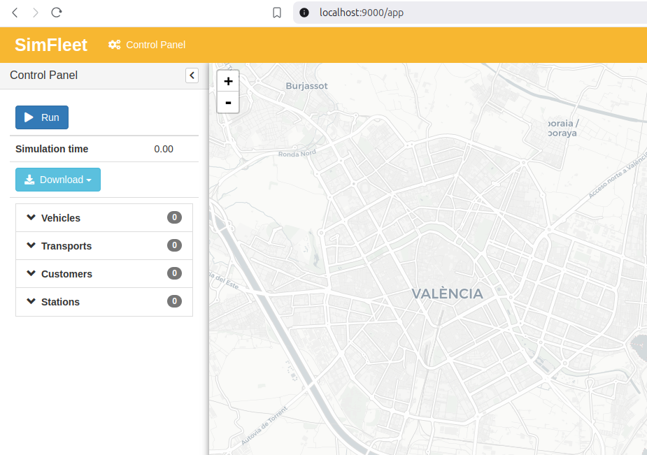
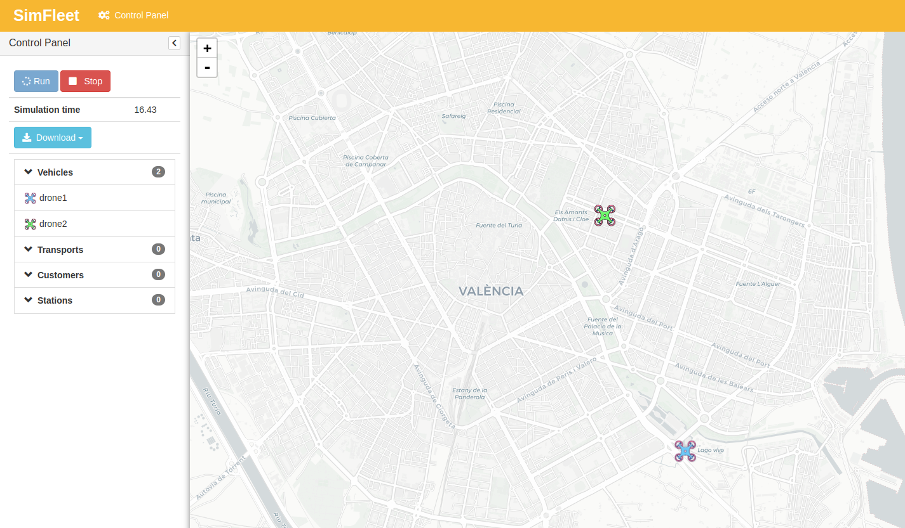

============
Quickstart
============

This quickstart guide demonstrates how to launch a basic simulation in SimFleet using vehicles as the sole mode of transportation with
the web-based graphical interface (GUI). Make sure you have the appropriate configuration file (in this case, ``vehicles.json``), which defines vehicle movements with specified
origins and destinations.

Steps to Start a Simulation:

Setting the Scenario
====================

SimFleet requires a configuration file to define a simulation scenario, including the information of each present agent. The configuration file must be written in **JSON format**.

Here's an example of a configuration file of a scenario with only two vehicle agents:

.. code-block:: json

    {
    "fleets": [],
    "transports": [],
    "customers": [],
    "stations": [],
    "vehicles": [
        {
            "speed": 2000,
            "class": "simfleet.common.lib.vehicles.models.vehicle.VehicleAgent",
            "position": [
                39.457364,
                -0.401621
            ],
            "destination": [
                39.45333818,
                -0.33223699
            ],
            "password": "secret",
            "name": "drone1",
            "icon": "drone"
        },
        {
            "speed": 2000,
            "class": "simfleet.common.lib.vehicles.models.vehicle.VehicleAgent",
            "password": "secret",
            "name": "drone2",
            "icon": "drone"
        }
	],
    "simulation_name": "drone",
    "max_time": 30,
    "vehicle_strategy": "simfleet.common.lib.vehicles.strategies.vehicle.FSMOneShotVehicleBehaviour",
    "host": "localhost",
    "http_port": 9000

    }

Starting the Simulator
======================

Once you have downloaded the configuration file ``vehicles.json``, open a console in the same folder and start the simulator using the following command:

.. code-block:: console

    $ simfleet --config vehicles.json

.. hint:: For the simulator to work, you need to run the XMPP message server. To do this, open a new command prompt and run the following command:

    .. code-block:: console

        $ spade run

Accessing the GUI
=================

A more user-friendly way to interact with SimFleet is through the built-in Graphical User Interface (GUI). This interface can be accessed via any web browser and serves as a viewer for your running simulations.

To open the GUI, simply visit the address shown on the screen when you start the simulator. The address will be displayed in the console output.

.. hint::
    The Simulator agent is who raises the GUI and shows the address in the console output:

    .. code-block:: console

        2024-11-25 16:29:07.229 | INFO     | simfleet.simulator:setup:110 - Web interface running at http://127.0.0.1:9000/app

    This address is (in most cases): `http://127.0.0.1:9000/app <http://127.0.0.1:9000/app>`_

GUI Overview
============

Once you visit the GUI address you see an interface like this:

GUI at startup

In the GUI you can see a map of the city on the right and a Control Panel with various options on the left:

#. A **Run** button that starts the simulation.

#. A **Stop** button to stop and reset the simulation.

#. A **Download** button to get the simulation events in json format.

#. A collapsable tree view with the agents that are active in the simulation.

When you press the **Run** button, the simulation will show the vehicles moving to their destinations.

Simulation in progress

Stopping the Simulator
======================

The console will display the default logging information during the simulation. You can stop the simulator by pressing ``Ctrl+C``
in the terminal or by clicking the **Stop** button in the GUI.

.. code-block:: console

    $ simfleet --config vehicles.json
    2024-11-25 16:35:15.429 | INFO     | simfleet.config.settings:load_config:134 - Reading config vehicles.json
    2024-11-25 16:35:15.710 | INFO     | simfleet.simulator:__init__:89 - Starting SimFleet (simulation_drone)
    2024-11-25 16:35:15.722 | INFO     | simfleet.simulator:load_icons:467 - Reading icons /simfleet/templates/data/img_drones.json
    2024-11-25 16:35:15.934 | INFO     | simfleet.common.agents.directory:setup:63 - Directory agent directory running
    2024-11-25 16:35:15.935 | INFO     | simfleet.simulator:__init__:119 - Creating 0 managers, 0 transports, 0 customers, 0 stations and 2 vehicles.
    2024-11-25 16:35:15.935 | INFO     | simfleet.simulator:load_scenario:169 - Loading scenario...
    2024-11-25 16:35:15.937 | INFO     | simfleet.simulator:load_scenario:192 - Loading lines...
    2024-11-25 16:35:16.061 | SUCCESS  | simfleet.simulator:gather_batch:258 - All agents gathered
    2024-11-25 16:35:16.292 | INFO     | simfleet.simulator:setup:133 - Simulator agent running
    2024-11-25 16:35:16.295 | INFO     | simfleet.simulator:setup:151 - Web interface running at http://localhost:9000/app

    ^C

    2024-11-25 16:36:26.108 | INFO     | simfleet.simulator:stop:258 -
    Terminating... (17.3 seconds elapsed)
