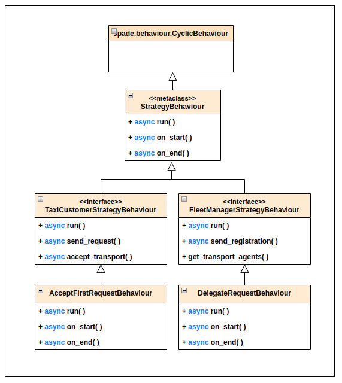
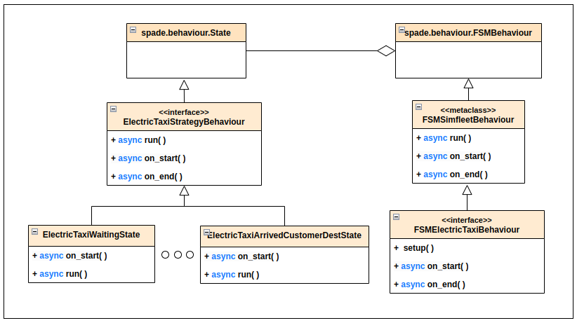

======================
Customising Strategies
======================

Why Add Strategies to Agents?
=============================

`Adding strategies to an agent is like giving a script to an actor in a complex play. It’s not enough for the actor to`
`have the perfect costume and the necessary skills—they also need a clear purpose and a set of instructions to react to`
`each scene.`

Strategies represent the behaviour and logic that guide an agent’s decisions within its environment. Without a strategy,
an agent would be like a talented actor lost on stage, unsure of how to respond to events. Strategies turn agents into
active and effective participants in their narrative, ensuring their performance aligns with the ultimate goal of the play.

The Strategy Pattern
====================

The **Strategy Pattern** is a design pattern that enables selecting an algorithm at runtime. The Strategy Pattern is
the best practice when an application incorporates different, alternative versions of an algorithm and we want to be
able to select any of these versions to be executed at run time. With this pattern, you can define a separate
strategy (implementation of the algorithm) in an object that encapsulates the algorithm. The application that executes
the algorithm **must** define an interface that every strategy (implementation) will follow, as it can be seen in
the following figure:

.. figure:: images/strategy.png
    :align: center
    :alt: The Strategy Pattern UML

    The Strategy Pattern UML.

Following this implementation, the context object can call the current strategy implementation without knowing how the
algorithm was implemented. This design pattern was created, among others, by a group of authors commonly known as the
**Gang of Four** (E. Gamma, R. Helm, R. Johnson and J. Vlissides), and it is well presented in [GangOfFour95]_.

SimFleet uses the *Strategy Pattern* in order to enable users to implement three different strategies (one for the
fleet manager agent, one for the transport agent and one for the customer agent) without having to develop new agents or
entering in the complexity of the simulator. Thanks to this pattern, users can develop their strategies in an external
file and pass it as an argument when the simulator is run.

The Strategy Pattern is a common design in programming that allows for the dynamic selection of algorithms at runtime,
promoting flexibility and code reuse. In this context, strategies are represented as specific classes that inherit from
generic behaviours and extend or redefine specific functionalities. This pattern is particularly useful in the realm of
intelligent agents, where decisions and behaviours may vary depending on the requirements.

Below are two main classes related to the Strategy Pattern found in the `abstractstrategies.py` module:

The Strategy Behaviour
----------------------

The :class:`StrategyBehaviour` metaclass is a base class designed to implement the Strategy Pattern. It provides a framework that
allows the customization of behaviors for agents. It ensures that all strategies inherit from a common parent, making
it easier to define and manage lifecycle events like initialization, execution, and cleanup.

    The StrategyBehaviour class and their inherited interfaces

Key Characteristics:
~~~~~~~~~~~~~~~~~~~~

* **Inheritance Structure:** The :class:`StrategyBehaviour` class extends the ``spade.behaviour.CyclicBehaviour`` from SPADE and uses an ABCMeta metaclass to enforce abstract methods.

* **Lifecycle Management:** It includes ``on_start()`` and ``on_end()`` methods to manage pre- and post-execution events. These methods log lifecycle events and provide hooks for custom statistics tracking.

* **Abstract Run Method:** The ``run()`` method is abstract and must be implemented by all subclasses. This enforces the definition of agent-specific behaviors when designing strategies.

.. danger::
    Don't store information in the Behaviour itself since it is a cyclic behaviour and is run by calling repeteadly the
    ``run`` coroutine, so the context of the function is not persistent. Use the agent variable that is accesible from
    any behaviour as `self.agent`. (i.e. you can do ``self.agent.set("my_key", "my_value")`` and ``self.agent.get("my_key")``.

The ``set`` and ``get`` functions allow to store persistent information in the
agent and to recover it at any moment. The store uses a *key-value* interface to store custom-defined data.

Example Implementation:
~~~~~~~~~~~~~~~~~~~~~~~

For instance, the :class:`TaxiCustomerStrategyBehaviour` class inherits from StrategyBehaviour and defines:

* ``send_request()`` Sends transport requests to FleetManager agents.

* ``accept_transport()`` Accepts a transport proposal from a transport agent.

* ``refuse_transport()``: Refuses a transport proposal from a transport agent.

The strategy can be further specialized. For example:

* :class:`AcceptFirstRequestBehaviour` of `TaxiCustomer`: Accepts the first valid transport offer received from a taxi.

The Strategy Behaviour decouples the strategy logic from the agent's core, allowing agents to switch strategies dynamically
at runtime. It enables modularity and extensibility in multi-agent systems

The FSM Simfleet Behaviour
--------------------------

The :class:`FSMSimfleetBehaviour` class extends the base Strategy Behaviour by combining it with Finite State Machine (FSM) logic,
enabling agents to transition between discrete states while maintaining a defined lifecycle.

    The FSMSimfleetBehaviour class and their inherited interfaces

Key Characteristics:
~~~~~~~~~~~~~~~~~~~~

* **FSM Framework:** This class leverages the ``spade.behaviour.FSMBehaviour`` framework to implement agents with multiple states. Each state corresponds to a specific stage in the agent's operation (e.g., a taxi waiting for customers, moving to a destination, or charging).

* **Lifecycle Management:** Similar to `StrategyBehaviour`, it includes ``on_start()`` and ``on_end()`` methods, ensuring consistency in event tracking across all states.

* **State Definition and Transition:** The ``setup()`` method is overridden to define the states and transitions for an FSM. Transitions dictate how the agent progresses between states based on certain conditions or events.

Example Implementation:
~~~~~~~~~~~~~~~~~~~~~~~

An :class:`ElectricTaxiAgent` uses the :class:`FSMSimfleetBehaviour` to handle multiple states such as:

* Waiting for a Customer: :class:`ElectricTaxiWaitingState()`.

* Moving to a Customer: :class:`ElectricTaxiMovingToCustomerState()`.

* Charging at a Station: :class:`ElectricTaxiChargingState()`.

.. hint::
    The State class provides a structure for defining individual states, including the on_start and run methods,
    which control what happens when the state is entered and its main behavior, respectively. By extending State,
    the :class:`ElectricTaxiStrategyBehaviour` class ensures compatibility with FSMBehavior while adding domain-specific functionality.

Developing the FleetManager Agent Strategy
------------------------------------------

In order to develop a new strategy for the FleetManager Agent, you need to create a class that inherits from
``FleetManagerStrategyBehaviour``. Since this is a cyclic behaviour class that follows the *Strategy Pattern* and
that inherits from the ``StrategyBehaviour``, it has all the previously presented helper functions for
communication and storing data inside the agent.

Following the *REQUEST* protocol, the FleetManager agent is supposed to receive every request for a transport service
from customers and to carry out the action that your strategy determines (note that, in the default strategy
``DelegateRequestBehaviour``, the fleet manager delegates the decision to the transports themselves by redirecting all
requests to all their registered transports without any previous, additional reasoning).
The code of the ``DelegateRequestBehaviour`` is presented below.

The place in the code where your fleet manager strategy must be coded is the ``run`` coroutine. This
function is executed in an infinite loop until the agent stops. In addition, you may also overload the ``on_start``
and the ``on_end`` coroutines, in order to execute code before the creation of the strategy or after its destruction,
if needed.

Code
~~~~
This is the code of the default fleet manager strategy :class:`DelegateRequestBehaviour`:

.. code-block:: python

    from simfleet.common.agents.fleetmanager import FleetManagerStrategyBehaviour

    async def run(self):
        if not self.agent.registration:
            # Register into Directory Agent to make your fleet public
            await self.send_registration()

        msg = await self.receive(timeout=5)
        logger.debug("Manager received message: {}".format(msg))
        if msg:
            # Redirect request to all your registered transports
            for transport in self.get_transport_agents().values():
                msg.to = str(transport["jid"])
                logger.debug("Manager sent request to transport {}".format(transport["name"]))
                await self.send(msg)

Helpers
~~~~~~~

The fleet manager agent incorporates two helper functions:

* ``send_registration``

    Registers its fleet in the Directory agent. This way customers can find their fleet and request for services.

* ``get_transport_agents``

    Returns a list of the transports that are registered in that fleet.

Developing the Transport Agent Strategy
---------------------------------------

To develop a new FSM strategy for the Transport Agent (in this case: ``ElectricTaxiAgent``), you need to create a FSM class ``FSMElectricTaxiBehaviour``
that inherits from ``FSMSimfleetBehaviour``. Since this is a FSM behaviour class that follows the *Strategy Pattern*, and this allows agents to model their
behavior as a set of discrete states with defined transitions. Each state encapsulates specific agent behavior, making it easier to design complex and dynamic strategies.

Then, you need to create a class that inherits from ``ElectricTaxiStrategyBehaviour``. This class defines the core reusable logic for states,
such as managing transitions, updating agent status, etc.

The transport strategy is intended to receive requests from customers, forwarded by its fleet manager agent, and then to send
proposals to these customers in order to be selected by the corresponding customer. If a transport proposal is accepted,
then the transport begins the process of going to the customer's current position, picking the customer up, and taking the customer
to the requested destination.

.. warning::
    The process that implies a transport movement is out of the scope of the strategy and should not be addressed by the
    strategy implementation. This customer-transfer process is automatically triggered when the strategy executes the
    MovableMixin helper coroutine ``move_to``.

The place in the code where your transport strategy must be coded is the ``run`` coroutine. This
function is executed in an infinite loop until the agent stops. In addition, you may also overload the ``on_start``
and the ``on_end`` coroutines, in order to execute code before the creation of the strategy or after its destruction,
if needed.

Code
~~~~
The default strategy of a transport (``ElectricTaxiAgent``) is to accept any customers' request if the transport is not assigned to any other customer
or waiting a confirmation from any customer. This is the code of the default electric taxi strategy ``FSMElectricTaxiBehaviour``:

.. code-block:: python

    from simfleet.utils.abstractstrategies import FSMSimfleetBehaviour

    class FSMElectricTaxiBehaviour(FSMSimfleetBehaviour):
        def setup(self):

            # Add states to the FSM
            self.add_state(TRANSPORT_WAITING, ElectricTaxiWaitingState(), initial=True)
            self.add_state(TRANSPORT_NEEDS_CHARGING, ElectricTaxiNeedsChargingState())
            self.add_state(TRANSPORT_WAITING_FOR_APPROVAL, ElectricTaxiWaitingForApprovalState())
            self.add_state(TRANSPORT_MOVING_TO_CUSTOMER, ElectricTaxiMovingToCustomerState())
            self.add_state(TRANSPORT_ARRIVED_AT_CUSTOMER, ElectricTaxiArrivedAtCustomerState())
            self.add_state(TRANSPORT_MOVING_TO_DESTINATION, ElectricTaxiMovingToCustomerDestState())
            self.add_state(TRANSPORT_ARRIVED_AT_DESTINATION, ElectricTaxiArrivedAtCustomerDestState())
            self.add_state(TRANSPORT_MOVING_TO_STATION, ElectricTaxiMovingToStationState())
            self.add_state(TRANSPORT_IN_STATION_PLACE, ElectricTaxiInStationState())
            self.add_state(TRANSPORT_IN_WAITING_LIST, ElectricTaxiInWaitingListState())
            self.add_state(TRANSPORT_CHARGING, ElectricTaxiChargingState())

            # Define transitions between states

            # Transitions related to the 'Waiting' state
            self.add_transition(TRANSPORT_WAITING, TRANSPORT_WAITING)  # Remains in waiting if no new action
            self.add_transition(TRANSPORT_WAITING, TRANSPORT_WAITING_FOR_APPROVAL)  # When a customer accepts a proposal
            self.add_transition(TRANSPORT_WAITING, TRANSPORT_NEEDS_CHARGING)  # If the taxi needs charging

            # Transitions from 'Waiting For Approval' state
            self.add_transition(TRANSPORT_WAITING_FOR_APPROVAL, TRANSPORT_WAITING_FOR_APPROVAL)  # Keep waiting for approval
            self.add_transition(TRANSPORT_WAITING_FOR_APPROVAL, TRANSPORT_WAITING)  # If the proposal is refused
            self.add_transition(TRANSPORT_WAITING_FOR_APPROVAL, TRANSPORT_MOVING_TO_CUSTOMER)  # If the customer accepts
            self.add_transition(TRANSPORT_WAITING_FOR_APPROVAL, TRANSPORT_ARRIVED_AT_CUSTOMER)  # Direct arrival scenario

            # Transitions from 'Moving To Customer' state
            self.add_transition(TRANSPORT_MOVING_TO_CUSTOMER, TRANSPORT_MOVING_TO_CUSTOMER)  # Still moving
            self.add_transition(TRANSPORT_MOVING_TO_CUSTOMER, TRANSPORT_WAITING)  # Encounter an issue, go back to waiting
            self.add_transition(TRANSPORT_MOVING_TO_CUSTOMER, TRANSPORT_ARRIVED_AT_CUSTOMER)  # Successfully arrive

            # Transitions from 'Arrived At Customer' state
            self.add_transition(TRANSPORT_ARRIVED_AT_CUSTOMER, TRANSPORT_ARRIVED_AT_CUSTOMER)  # Waiting at customer's location
            self.add_transition(TRANSPORT_ARRIVED_AT_CUSTOMER, TRANSPORT_MOVING_TO_DESTINATION)  # Begin journey to destination
            self.add_transition(TRANSPORT_ARRIVED_AT_CUSTOMER, TRANSPORT_ARRIVED_AT_DESTINATION)  # Direct destination arrival
            self.add_transition(TRANSPORT_ARRIVED_AT_CUSTOMER, TRANSPORT_WAITING)  # Cancel and return to waiting

            # Transitions from 'Moving To Destination' state
            self.add_transition(TRANSPORT_MOVING_TO_DESTINATION, TRANSPORT_MOVING_TO_DESTINATION)  # Still moving to destination
            self.add_transition(TRANSPORT_MOVING_TO_DESTINATION, TRANSPORT_WAITING)  # An issue encountered, return to waiting
            self.add_transition(TRANSPORT_MOVING_TO_DESTINATION, TRANSPORT_ARRIVED_AT_DESTINATION)  # Arrival at destination

            # Transitions from 'Arrived At Destination' state
            self.add_transition(TRANSPORT_ARRIVED_AT_DESTINATION, TRANSPORT_ARRIVED_AT_DESTINATION)  # Stay at destination
            self.add_transition(TRANSPORT_ARRIVED_AT_DESTINATION, TRANSPORT_WAITING)  # Drop customer and return to waiting

            # Transitions related to the 'Needs Charging' state
            self.add_transition(TRANSPORT_NEEDS_CHARGING, TRANSPORT_NEEDS_CHARGING)  # Continue searching for a station
            self.add_transition(TRANSPORT_NEEDS_CHARGING, TRANSPORT_WAITING)  # Issue finding station, return to waiting
            self.add_transition(TRANSPORT_NEEDS_CHARGING, TRANSPORT_MOVING_TO_STATION)  # Successfully heading to station
            self.add_transition(TRANSPORT_NEEDS_CHARGING, TRANSPORT_IN_STATION_PLACE)  # Arrives at the station

            # Transitions from 'Moving To Station' state
            self.add_transition(TRANSPORT_MOVING_TO_STATION, TRANSPORT_MOVING_TO_STATION)  # Still heading to the station
            self.add_transition(TRANSPORT_MOVING_TO_STATION, TRANSPORT_IN_STATION_PLACE)  # Arrives at station

            # Transitions from 'In Station Place' state
            self.add_transition(TRANSPORT_IN_STATION_PLACE, TRANSPORT_IN_STATION_PLACE)  # Waiting in station queue
            self.add_transition(TRANSPORT_IN_STATION_PLACE, TRANSPORT_NEEDS_CHARGING)  # Transition if refused service
            self.add_transition(TRANSPORT_IN_STATION_PLACE, TRANSPORT_IN_WAITING_LIST)  # Moved to waiting list for service

            # Transitions from 'In Waiting List' state
            self.add_transition(TRANSPORT_IN_WAITING_LIST, TRANSPORT_IN_WAITING_LIST)  # Remain in queue
            self.add_transition(TRANSPORT_IN_WAITING_LIST, TRANSPORT_CHARGING)  # Begin charging process

            # Transitions from 'Charging' state
            self.add_transition(TRANSPORT_CHARGING, TRANSPORT_CHARGING)  # Continue charging
            self.add_transition(TRANSPORT_CHARGING, TRANSPORT_WAITING)  # Finish charging and return to waiting

            # Additional transitions for customer movement and destination states
            self.add_transition(TRANSPORT_MOVING_TO_CUSTOMER, TRANSPORT_MOVING_TO_CUSTOMER)  # Still en route to customer
            self.add_transition(TRANSPORT_MOVING_TO_CUSTOMER, TRANSPORT_WAITING)  # Return to waiting if issue arises

Each state inherits from ElectricTaxiStrategyBehaviour, implementing the specific logic for its role. Below are examples of states that leverage this reusable functionality

.. code-block:: python
    class ElectricTaxiWaitingState(ElectricTaxiStrategyBehaviour):
        async def on_start(self):
            await super().on_start()
            self.agent.status = TRANSPORT_WAITING
        async def run(self):
            msg = await self.receive(timeout=60)
            if not msg:
                self.set_next_state(TRANSPORT_WAITING)
                return
            logger.debug("Agent[{}]: The agent received: {}".format(self.agent.jid, msg.body))
            content = json.loads(msg.body)
            performative = msg.get_metadata("performative")
            if performative == REQUEST_PERFORMATIVE:
                if not self.agent.has_enough_autonomy(content["origin"], content["dest"]):
                    await self.cancel_proposal(content["customer_id"])
                    self.set_next_state(TRANSPORT_NEEDS_CHARGING)
                    return
                else:
                    await self.send_proposal(content["customer_id"], {})
                    self.set_next_state(TRANSPORT_WAITING_FOR_APPROVAL)
                    return
            else:
                self.set_next_state(TRANSPORT_WAITING)
                return

    class ElectricTaxiNeedsChargingState(ElectricTaxiStrategyBehaviour):
        async def on_start(self):
            await super().on_start()
            self.agent.status = TRANSPORT_NEEDS_CHARGING
        async def run(self):
            if (
                self.agent.get_stations() is None
                or self.agent.get_number_stations() < 1
            ):
                logger.info("Agent[{}]: The agent looking for a station.".format(self.agent.name))
                stations = await self.agent.get_list_agent_position(self.agent.service_type, self.agent.get_stations())
                self.agent.set_stations(stations)
                self.set_next_state(TRANSPORT_NEEDS_CHARGING)
                return
            else:
                nearby_station_dest = self.agent.nearst_agent(self.agent.get_stations(), self.agent.get_position())
                self.agent.set_nearby_station(nearby_station_dest)
                logger.info(
                     "Agent[{}]: The agent selected station [{}].".format(self.agent.name, self.agent.get_nearby_station_id())
                 )
                try:
                    await self.go_to_the_station(self.agent.get_nearby_station_id(), self.agent.get_nearby_station_position())
                    try:
                        logger.debug("{} move_to station {}".format(self.agent.name, self.agent.get_nearby_station_id()))
                        await self.agent.move_to(self.agent.get_nearby_station_position())

                        self.agent.status = TRANSPORT_MOVING_TO_STATION
                        self.set_next_state(TRANSPORT_MOVING_TO_STATION)
                    except AlreadyInDestination:
                        logger.debug(
                            "Agent[{}]: The agent is already in the stations' ({}) position. . .".format(
                                self.agent.name, self.agent.get_nearby_station_id()
                            )
                        )
                        self.agent.arguments["transport_need"] = self.agent.max_autonomy_km - self.agent.current_autonomy_km

                        content = {"service_name": self.agent.service_type,
                                "args": self.agent.arguments}
                        await self.request_access_station(self.agent.get("current_station"), content)

                        self.agent.status = TRANSPORT_IN_STATION_PLACE
                        self.set_next_state(TRANSPORT_IN_STATION_PLACE)
                        return
                    return
                except PathRequestException:
                    logger.error(
                        "Agent[{}]: The agent could not get a path to station [{}]. Cancelling...".format(
                            self.agent.name, self.agent.get_nearby_station_id()
                        )
                    )
                    await self.cancel_proposal(self.agent.get_nearby_station_id())
                    self.agent.status = TRANSPORT_WAITING
                    self.set_next_state(TRANSPORT_WAITING)
                    return
                except Exception as e:
                    logger.error(
                        "Unexpected error in transport [{}]: {}".format(self.agent.name, e)
                    )
                    self.agent.status = TRANSPORT_WAITING
                    self.set_next_state(TRANSPORT_WAITING)
                    return

Helpers
~~~~~~~

There are some helper coroutines that are specific for the transport strategy:

.. code-block:: python

            async def send_proposal(self, customer_id, content=None)
            async def cancel_proposal(self, customer_id, content=None)
            async def pick_up_customer(self, customer_id, origin, dest)

The definition and purpose of each of them is now introduced:

* ``send_proposal``

    This helper function simplifies the composition and sending of a message containing a proposal to a customer. It sends a
    ``Message`` to ``customer_id`` using the **REQUEST_PROTOCOL** and a **PROPOSE_PERFORMATIVE**. It optionally
    accepts a `content` parameter where you can include any additional information you may want the customer to analyze.

* ``cancel_proposal``

    This helper function simplifies the composition and sending of a message to a customer to cancel a proposal. It sends a
    ``Message`` to ``customer_id`` using the **REQUEST_PROTOCOL** and a **CANCEL_PERFORMATIVE**. It optionally
    accepts a `content` parameter where you can include any additional information you may want the customer to analyze.

* ``pick_up_customer``

    This helper function triggers the **TRAVEL_PROTOCOL** of a transport, which is the protocol that is used to transport a
    customer from her current position to her destination. This is a very important and particular function. Invoking
    this function is normally the last instruction of this strategy, since it means that the purpose of the strategy
    is accomplished (until the **TRAVEL_PROTOCOL** ends and the transport is again free and able to receive new requests
    from some other customers).

    The ``pick_up_customer`` helper receives as parameters the id of the customer and the coordinates of the
    customer's current position (``origin``) and its destination (``dest``).

How to Implement New Strategies -- Recommendations
==================================================

At this point is time for you to implement your own strategies to optimize the problem of dispatching transports to customers.
In this chapter we have shown you the tools to create these strategies. You have to create a file (in this example we
are using ``my_strategy_file.py``) and develop the strategies to be tested following the next template:

.. code-block:: python

    from simfleet.common.agents.fleetmanager import FleetManagerStrategyBehaviour
    from simfleet.common.lib.transports.models.electrictaxi import ElectricTaxiStrategyBehaviour
    from simfleet.common.lib.customers.models.taxicustomer import TaxiCustomerStrategyBehaviour

    ################################################################
    #                                                              #
    #                     FleetManager Strategy                    #
    #                                                              #
    ################################################################
    class MyFleetManagerStrategy(FleetManagerStrategyBehaviour):
        async def run(self):
           # Your code here

    ################################################################
    #                                                              #
    #                         Transport Strategy                   #
    #                                                              #
    ################################################################
    class MyTransportStrategy(ElectricTaxiStrategyBehaviour):
        async def run(self):
           # Your code here

    ################################################################
    #                                                              #
    #                       Customer Strategy                      #
    #                                                              #
    ################################################################
    class MyCustomerStrategy(TaxiCustomerStrategyBehaviour):
        async def run(self):
           # Your code here

In this file, three strategies have been created for the three types of agent handled by the simulator. We have called
these strategies ``MyFleetManagerStrategy``, ``MyTransportStrategy`` and ``MyCustomerStrategy``.

To run the simulator with your new strategies the configuration file accepts three parameters with the name of the
file (without extension) and the name of the class of each strategy.

.. code-block:: json

    {
        "fleets": [...],
        "transports": [...],
        "customers": [...],
        "stations": [...],
        "simulation_name": "My Config",
        "max_time": 1000,
        "transport_strategy": "my_strategy_file.MyTransportStrategy",
        "customer_strategy": "my_strategy_file.MyCustomerStrategy",
        "fleetmanager_strategy": "my_strategy_file.MyFleetManagerStrategy",
        ...
        "host": "localhost",
    }

.. code-block:: bash

 $ simfleet --config my_custom_simulation.json

.. warning::
    The file must be in the current working directory and it must be referenced *without* the extension (if the file is
    named ``my_strategy_file.py`` use ``my_strategy_file`` when calling the simulator.

Once run the simulator you can test your strategies using the graphical web interface or by inspecting the output of the
logs in the command line.

.. [GangOfFour95] E. Gamma, R. Helm, R. Johnson, and J. Vlissides. Design Patterns, Elements of Reusable Object Oriented Software. Addison-Wesley, 1995.
