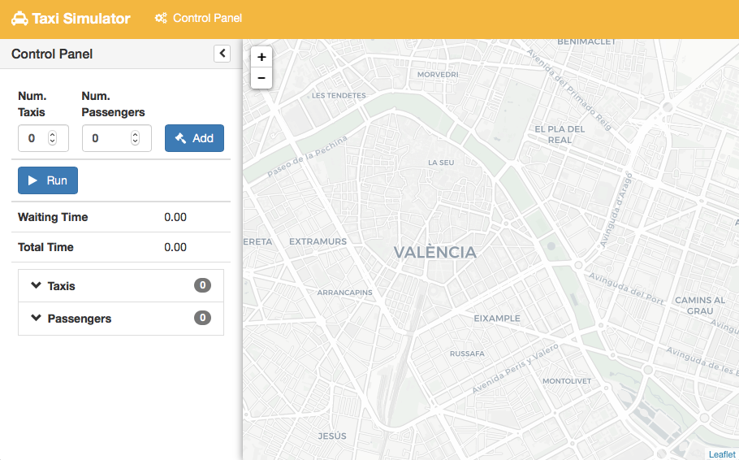
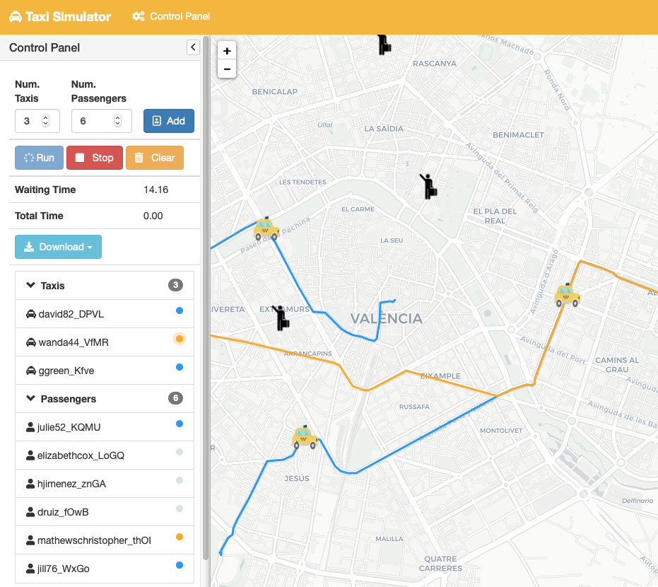

==========
Quickstart
==========

.. contents:: Table of Contents

Usage
=====

Using Taxi Simulator is as easy as running the application in a command line. There are two use modes: a command-line
interface and a graphical web-based view. You can run simulations using only the command line or using the more easy and
intuitive graphical user interface. Running Taxi Simulator without your own developed coordination strategies is posible
since the application comes with a set of default strategies. Let's explore how to use both user interfaces.

Command-line interface
======================

After installing Taxi Simulator open a command-line and type ``taxi_simulator --host your_xmpp_server``. This starts a
simulator without any options and runs the coordinator agent. The console will output the default logging
information and you can terminate the simulator by pressing ``Ctrl+C``. When you terminate the simulator the results of
the simulations are printed.

.. warning:: Note that ``your_xmpp_server`` is a fake address. You need to have an XMPP server where the simulator
    connects to. You can use your own XMPP server or use any of the public XMPP servers (List of public servers is
    `here <https://list.jabber.at>`).

.. hint:: To install an XMPP server visit https://xmpp.org/software/servers.html (we recommend `Prosody IM <https://prosody.im>`_)

.. code-block:: console

    $ taxi_simulator --host 127.0.0.1
    INFO:root:Starting Taxi Simulator
    INFO:CoordinatorAgent:Coordinator agent running
    INFO:CoordinatorAgent:Web interface running at http://127.0.0.1:9000/app
    INFO:root:Creating 0 taxis and 0 passengers.
    INFO:RouteAgent:Route agent running
    WARNING:RouteAgent:Could not load cache file.

    ^C
    INFO:root: Terminating... (0.0 seconds elapsed)
    Simulation Results
    ╒════════════════════╤══════════════════╤═══════════════════╤═══════════════════════╕
    │   Avg Waiting Time │   Avg Total Time │   Simulation Time │ Simulation Finished   │
    ╞════════════════════╪══════════════════╪═══════════════════╪═══════════════════════╡
    │                  0 │                0 │                 0 │ True                  │
    ╘════════════════════╧══════════════════╧═══════════════════╧═══════════════════════╛
    Passenger stats
    ╒════════╤════════════════╤══════════════╤══════════╕
    │ name   │ waiting_time   │ total_time   │ status   │
    ╞════════╪════════════════╪══════════════╪══════════╡
    ╘════════╧════════════════╧══════════════╧══════════╛
    Taxi stats
    ╒════════╤═══════════════╤════════════╤══════════╕
    │ name   │ assignments   │ distance   │ status   │
    ╞════════╪═══════════════╪════════════╪══════════╡
    ╘════════╧═══════════════╧════════════╧══════════╛

However, if you don't use some options when running the simulator there will be no default taxis nor passengers. That's
why stats are empty. To run a simulation with some parameters you can use the command-line interface options.

To show these options you can enter the ``--help`` command:

.. code-block:: console

    $ taxi_simulator --help

    Usage: taxi_simulator [OPTIONS]

      Console script for taxi_simulator.

    Options:
      -n, --name TEXT                Name of the simulation execution.
      -o, --output TEXT              Filename to save simulation results.
      -of, --oformat [json|excel]    Output format used to save simulation
                                     results. (default: json)
      -mt, --max-time INTEGER        Maximum simulation time (in seconds).
      -r, --autorun                  Run simulation as soon as the agents are
                                     ready.
      -t, --taxi TEXT                Taxi strategy class (default:
                                     AcceptAlwaysStrategyBehaviour).
      -p, --passenger TEXT           Passenger strategy class (default:
                                     AcceptFirstRequestTaxiBehaviour).
      -c, --coordinator TEXT         Coordinator strategy class (default:
                                     DelegateRequestTaxiBehaviour).
      --port INTEGER                 Web interface port (default: 9000).
      -nt, --num-taxis INTEGER       Number of initial taxis to create (default:
                                     0).
      -np, --num-passengers INTEGER  Number of initial passengers to create
                                     (default: 0).
      --scenario TEXT                Filename of JSON file with initial scenario
                                     description.
      -cn, --coordinator-name TEXT   Coordinator agent name (default:
                                     coordinator).
      --coord-passwd TEXT            Coordinator agent password (default:
                                     coordinator_passwd).
      -rn, --route-name TEXT         Route agent name (default: route).
      --route-passwd TEXT            Route agent password (default: route_passwd).
      --host TEXT                    XMPP server address
      -ip, --ip-address TEXT         IP to serve web (default: 127.0.0.1).
      -v, --verbose                  Show verbose debug level: -v level 1, -vv
                                     level 2, -vvv level 3, -vvvv level 4
      --help                         Show this message and exit.

Running a simulation from the command-line
~~~~~~~~~~~~~~~~~~~~~~~~~~~~~~~~~~~~~~~~~~

To run a quick simulation from the command-line you need to set up a few arguments: the number of taxis, the number of
passengers and (optionally) the maximum time of simulation.
The argument ``--num-taxis`` (or ``-nt``` initializates the specified number of taxis in random positions of the map.
The argument ``--num-passengers`` (or ``-np``` initializates the specified number of passengers in random positions of
the map and with a random destination for each one. If you want limit the simulation time tou can use the ``--max-time``
argument (or ``-mt``) to set the maximum number of seconds after which the simulation will end. Finally, the
``--autorun`` argument (or ``-r``) automatically runs the simulation (this argument is important when you are not using
the graphical interface, since it is the only way to start the simulation).

.. warning:: The ``--host`` argument is important to specify where your XMPP server is (localhost or external)

Example:

.. code-block:: console

    $ taxi_simulator --host 127.0.0.1 --num-taxis 2 --num-passengers 2 --max-time 60 --autorun
    INFO:root:Starting Taxi Simulator
    INFO:CoordinatorAgent:Coordinator agent running
    INFO:CoordinatorAgent:Web interface running at http://127.0.0.1:9000/app
    INFO:root:Creating 2 taxis and 2 passengers.
    INFO:RouteAgent:Route agent running
    INFO:CoordinatorAgent:Simulation started.
    INFO:PassengerAgent:Passenger michelle08 asked for a taxi to [39.469057, -0.406452].
    INFO:PassengerAgent:Passenger schapman asked for a taxi to [39.465762, -0.382746].
    INFO:TaxiAgent:Taxi stevencortez sent proposal to passenger michelle08
    INFO:TaxiAgent:Taxi austin05 sent proposal to passenger michelle08
    INFO:PassengerAgent:Passenger michelle08 accepted proposal from taxi stevencortez@127.0.0.1
    INFO:PassengerAgent:Passenger michelle08 refused proposal from taxi austin05@127.0.0.1
    INFO:TaxiAgent:Taxi stevencortez on route to passenger michelle08
    INFO:PassengerAgent:Passenger michelle08 informed of status: 11
    INFO:PassengerAgent:Passenger michelle08 waiting for taxi.
    INFO:TaxiAgent:Taxi stevencortez has arrived to destination.
    INFO:PassengerAgent:Passenger schapman asked for a taxi to [39.465762, -0.382746].
    INFO:TaxiAgent:Taxi austin05 sent proposal to passenger schapman
    INFO:PassengerAgent:Passenger schapman accepted proposal from taxi austin05@127.0.0.1
    INFO:TaxiAgent:Taxi austin05 on route to passenger schapman
    INFO:PassengerAgent:Passenger schapman informed of status: 11
    INFO:PassengerAgent:Passenger schapman waiting for taxi.
    INFO:TaxiAgent:Taxi stevencortez has picked up the passenger michelle08@127.0.0.1.
    INFO:PassengerAgent:Passenger michelle08 informed of status: 12
    INFO:PassengerAgent:Passenger michelle08 in taxi.
    INFO:TaxiAgent:Taxi stevencortez has arrived to destination.
    INFO:TaxiAgent:Taxi stevencortez has dropped the passenger michelle08@127.0.0.1 in destination.
    INFO:PassengerAgent:Passenger michelle08 informed of status: 22
    INFO:PassengerAgent:Passenger michelle08 arrived to destination after 10.8725750446 seconds.
    INFO:TaxiAgent:Taxi austin05 has arrived to destination.
    INFO:TaxiAgent:Taxi austin05 has picked up the passenger schapman@127.0.0.1.
    INFO:PassengerAgent:Passenger schapman informed of status: 12
    INFO:PassengerAgent:Passenger schapman in taxi.
    INFO:TaxiAgent:Taxi austin05 has arrived to destination.
    INFO:TaxiAgent:Taxi austin05 has dropped the passenger schapman@127.0.0.1 in destination.
    INFO:PassengerAgent:Passenger schapman informed of status: 22
    INFO:PassengerAgent:Passenger schapman arrived to destination after 22.221298933 seconds.
    INFO:root:
    Terminating... (22.7 seconds elapsed)
    INFO:CoordinatorAgent:Stopping taxi stevencortez
    INFO:CoordinatorAgent:Stopping taxi austin05
    INFO:CoordinatorAgent:Stopping passenger michelle08
    INFO:CoordinatorAgent:Stopping passenger schapman
    Simulation Results
    ╒════════════════════╤══════════════════╤═══════════════════╤════════════╤═══════════════════════╕
    │   Avg Total Time   │ Avg Waiting Time │   Simulation Time │   Max Time │ Simulation Finished   │
    ╞════════════════════╪══════════════════╪═══════════════════╪════════════╪═══════════════════════╡
    │              22.69 │            16.55 │           22.6766 │         60 │ True                  │
    ╘════════════════════╧══════════════════╧═══════════════════╧════════════╧═══════════════════════╛
    Passenger stats
    ╒══════════════════════╤════════════════╤══════════════╤═══════════════════╕
    │ name                 │  total_time    │ waiting_time │ status            │
    ╞══════════════════════╪════════════════╪══════════════╪═══════════════════╡
    │ michelle08@127.0.0.1 │        22.685  │      10.8726 │ PASSENGER_IN_DEST │
    ├──────────────────────┼────────────────┼──────────────┼───────────────────┤
    │ schapman@127.0.0.1   │        22.6845 │      22.2213 │ PASSENGER_IN_DEST │
    ╘══════════════════════╧════════════════╧══════════════╧═══════════════════╛
    Taxi stats
    ╒════════════════════════╤═══════════════╤════════════╤══════════════╕
    │ name                   │   assignments │   distance │ status       │
    ╞════════════════════════╪═══════════════╪════════════╪══════════════╡
    │ stevencortez@127.0.0.1 │             1 │     4835.1 │ TAXI_WAITING │
    ├────────────────────────┼───────────────┼────────────┼──────────────┤
    │ austin05@127.0.0.1     │             1 │     7885.2 │ TAXI_WAITING │
    ╘════════════════════════╧═══════════════╧════════════╧══════════════╛

By analyzing the output of the simulation we can see what events have occurred and how the simulation has been
developed. There were created two taxis ( ``stevencortez`` and ``austin05``) and two passengers (``michelle08`` and
``schapman``). After the negotiation provided by the default strategies included in Taxi Simulator, taxi ``stevencortez``
was assigned to passenger ``michelle08`` and taxi ``austin05`` was assigned to passenger ``schapman``. After 22 seconds
of simulation both passengers were delivered in their destinations and taxis are free again to attend more passenger
requests.

The output of the simulation also shows some statistics of the simulation, with the `Average Total Time`, which
represents the average time of passengers from the moment they request a taxi until they are delivered to their
destination, and the `Average Waiting Time`, which is the average time of passengers from requesting a taxi to being
picked up. This information is also shown  for each passenger along with their status at the end of the simulation.

In the case of taxis, the shown information includes the number of assignments of each taxi (how many passengers it has
delivered), the total distance it has traveled and its final status.

This information is going to be useful for the development of new strategies that improve the system balancing or for
debugging errors if a taxi or a passenger gets stuck or any other unexpected situation occurs.


Saving the simulation results
~~~~~~~~~~~~~~~~~~~~~~~~~~~~~

If you want to store the results of simulation in a file you may use the ``--output`` option (or ``-o``) to specify the
name of the file where the simulation results will be saved. The ``--oformat`` (``-of``) allows you to choose the output
format between json (default) or excel. It is also useful to use the ``--name`` (or ``-n``) to name the simulation.

Example:

.. code-block:: console

    $ taxi_simulator --host 127.0.0.1 --name "My Simulation" --output results.xls --oformat excel


Advanced options
~~~~~~~~~~~~~~~~

There are other options that are less common and that you probably don't need to use very often. These are options that
allow you to change connection ports or default name and password of the coordinator agent. Use them only if there is a
port or name conflict.

The last but no less important option is the verbosity option. It allows you to specify how verbose you want the
simulator to be. The number of ``v`` letters you pass to the option indicates the level of verbosity (e.g. ``-v`` is
**DEBUG** verbosity and ``-vvvv`` is the highest level of verbosity where the internal messages of the platform are
shown).


.. note::
    You may have noticed that we haven't discussed three very important options that are: ``--taxi``, ``--passenger``,
    and ``--coordinator``. These options are used to inject new strategies to the simulator and we'll be discussed in a
    later chapter.
    Also, the ``--scenario`` option will be fully explained in a later section.


Graphical User Interface
========================
A much more user-friendly way to use Taxi Simulator is through the built-in graphical user interface. This interface is
accessed via any web browser. Just look at the address shown on the screen when you run the simulator and access that
website.

.. hint::
    The Coordinator agent is who raises the GUI and shows the address in the debug:

    .. code-block:: console

        INFO:CoordinatorAgent:Web interface running at http://127.0.0.1:9000/app

    This address is (in most cases): `http://127.0.0.1:9000/app <http://127.0.0.1:9000/app>`_

Once you visit the GUI address you see an interface like this:



    GUI at startup

In the GUI you can see a map of the city on the right and a Control Panel with various options on the left:

#. Two selectors to set the number of taxis and passengers and an **Add** button. When this button is pressed the number of taxis and passengers that are in the input boxes are created in random positions inside the map. This form is very similar to the command line option, except that you can add Taxi and Passenger agents at any time during the simulation.

#. A **Run** button that starts the simulation.

#. A **Clear** button to stop and reset the simulation.

#. Stats of the waiting time and total time of the simulation in real time.

#. A **Download** button to get the stats of the simulation in excel or json format.

#. A collapsable tree view with the taxis and passengers that are included in the simulation, with a color bullet that indicates their current status.

If the **Run** buttons is pressed the simulation shows how the taxis move to the passengers and deliver them to their
destinations.



    Simulation in progress

Notice that when a taxi picks up a passenger, the passenger's icon disappears from the map view (since it
is inside the taxi) and is no longer viewed (it's also not shown when it arrives to its desination). However, you can
check at any time your passengers status in the tree view of the Control Panel.

The code colors in the tree view indicate the status of a taxi or a passenger. The legend of colors is as follows:

+--------------------------------------+---------------------------------+
|                Taxis                 |             Passengers          |
+--------------+-----------------------+---------------+-----------------+
|  Bullet      |     Status            |  Bullet       |     Status      |
+==============+=======================+===============+=================+
| |positive|   | WAITING               | |active|      |  WAITING        |
+--------------+-----------------------+---------------+-----------------+
| |inter|      | WAITING FOR APPROVAL  | |inter|       |  ASSIGNED       |
+--------------+-----------------------+---------------+-----------------+
| |interpulse| | MOVING TO PASSENGER   | |activepulse| |  IN TAXI        |
+--------------+-----------------------+---------------+-----------------+
| |activepulse|| MOVING TO DESTINATION | |positive|    |  IN DESTINATION |
+--------------+-----------------------+---------------+-----------------+


.. |positive| image:: images/positive2.png
                :width: 36px

.. |inter| image:: images/inter2.png
                :width: 36px

.. |interpulse| image:: images/interpulse2.png
                :width: 36px

.. |activepulse| image:: images/activepulse2.png
                :width: 36px

.. |active| image:: images/active2.png
                :width: 36px

.. hint::
    Every time than a bullet is pulsing means that the agent is moving.


When a taxi is moving it's also shown in the GUI the path that the taxi is folowing. The color of the path indicates the
type of movement than the taxi is doing. A yellow path indicates that the taxi is going to pick up the passenger.
On the other hand, a blue path indicates that the taxi is taking the passenger to his destination.


.. note::
    A simulation is finished when all taxis are free (and waiting for new passengers) and all passengers are in their
    destinations (i.e. all bullets are green).


Loading Scenarios
=================

Adding agents using both the graphical interface and command line is convenient and fast, but if you want to perform
repeatable experiments where you choose where agents appear and what the destinations of the passengers are (rather than
random data) then you need the mechanism of the **scenarios**.

The ability to load scenarios to Taxi Simulator allows us to repeat the same experiment as many times as we want with
the same initial conditions. Taxi Simulator supports to load a *scenario* file that defines all the fields that you need
to load the same information repeatedly. A scenario file must be coded in JSON format.

The fields that the scenario file must include are a passengers list and a taxis list. Each passenger must include the
following fields:

+-----------+--------------------------------------------------------------------+
|  Field    |  Description                                                       |
+===========+====================================================================+
| position  |     Initial coordinates of the passenger                           |
+-----------+--------------------------------------------------------------------+
| dest      |    Destination coordinates of the passenger                        |
+-----------+--------------------------------------------------------------------+
| name      |    Name of the passenger                                           |
+-----------+--------------------------------------------------------------------+
| password  | Password for registering the passenger in the platform (optional)  |
+-----------+--------------------------------------------------------------------+

For taxis the fields are as follows:

+-----------+--------------------------------------------------------------------+
|  Field    |  Description                                                       |
+===========+====================================================================+
|position   |   Initial coordinates of the taxi                                  |
+-----------+--------------------------------------------------------------------+
|name       |   Name of the taxi                                                 |
+-----------+--------------------------------------------------------------------+
|password   |   Password for registering the taxi in the platform (optional)     |
+-----------+--------------------------------------------------------------------+
|speed      |   Speed of the taxi (in meters per second)                         |
+-----------+--------------------------------------------------------------------+

An example of a scenario file with two passengers and two taxis:

.. code-block:: json

    {
        "passengers": [
            {
                "dest": [ 39.463356, -0.376463 ],
                "position": [ 39.460568, -0.352529 ],
                "name": "michaelstewart",
                "password": "T3TnmjuI(m"
            },
            {
                "dest": [ 39.49529, -0.401478 ],
                "position": [ 39.49529, -0.401478 ],
                "name": "ghiggins",
                "password": "@5wPA$Mx#O"
            }
        ],
        "taxis": [
            {
                "position": [ 39.462618, -0.364888 ],
                "name": "taxi1",
                "password": "$JM!Zcwh0R",
                "speed": 2000
            },
            {
                "position": [ 39.478458, -0.406736 ],
                "password": "_bx1TBEiu8",
                "name": "taxi2",
                "speed": 2000
            }
        ]
    }


Finally, to load a scenario in a simulation use the ``--scenario`` option with the filename of the JSON file:

.. code-block:: console

    $ taxi_simulator --host 127.0.0.1 --scenario my_scenario.json

    INFO:root:Starting Taxi Simulator
    INFO:CoordinatorAgent:Coordinator agent running
    INFO:CoordinatorAgent:Web interface running at http://127.0.0.1:9000/app
    INFO:root:Creating 0 taxis and 0 passengers.
    INFO:root:Loading scenario my_scenario.json
    INFO:RouteAgent:Route agent running

