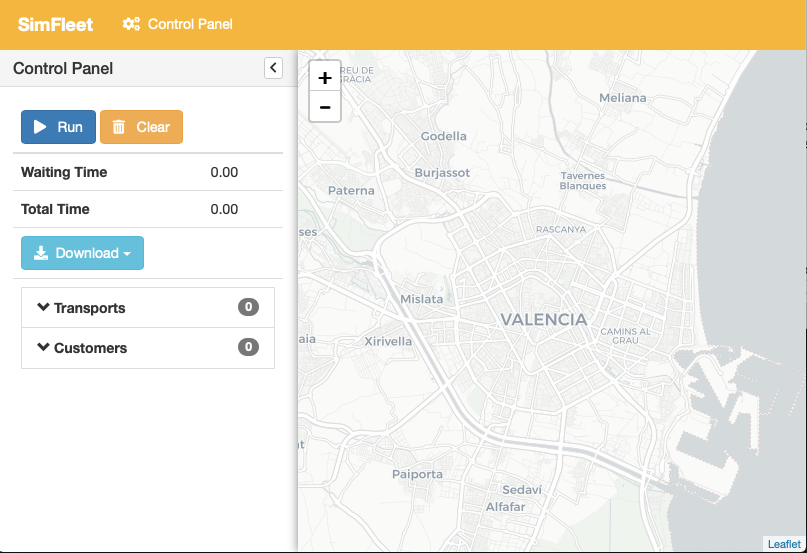
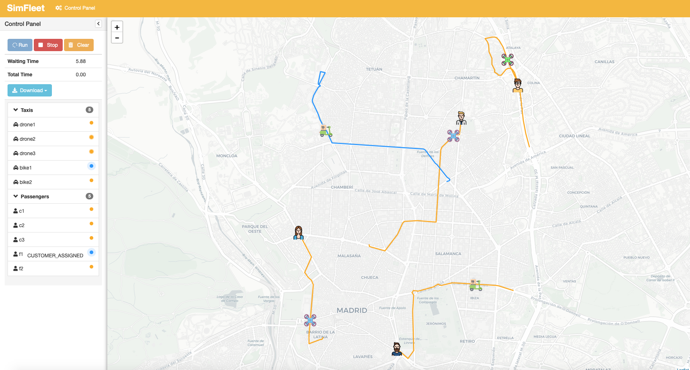

==========
Quickstart
==========

.. contents:: Table of Contents

Usage
=====

Using SimFleet is as easy as running the application in a command line. There are two use modes: a command-line
interface and a graphical web-based view. You can run simulations using only the command line or using the easier and
intuitive graphical user interface. Running SimFleet without your own developed strategies is posible
since the application comes with a set of default strategies. Let's explore how to use both user interfaces.

SimFleet entities summary
=========================

In SimFleet there are three types of agent that interact among them during simulations. These are the Fleet Manager
agent, the Transport agent, and the Customer agent.

Description of the Customer Agents
----------------------------------

The Customer agents represent people that need to go from one location of the city (their "current location") to
another (their "destination") or packages that need to be moved from an origin to a destination.
For doing so, each Customer agent requests a single
transport service and, once it is transported to its destination, it reaches its final state and ends its execution.

Description of the Transport Agent
----------------------------------

The Transport agents represent vehicles which can transport Customer agents from their current positions to their respective
destinations.

Description of the FleetManager Agent
-------------------------------------

The FleetManager Agent is responsible for putting in contact the Customer agents that need a transport service, and the Transport
agents that may be available to offer these services. In short, the FleetManager Agent acts like a transport call center, accepting
the incoming requests from customers (Customer agents) and forwarding these requests to the (appropriate) Transport agents.
In order to do so, the FleetManager has a registration protocol by which Transport agents subscribe to the Fleet Manager
that represents their fleet. This is automatically done when a Transport agent is started.

In the context of SimFleet, a "transport service" involves, once a particular Customer and Transport agents have reached
an agreement, the movement of the Transport agent from its current position to the Customer's position in
order to pick the Customer up, and then the transportation of the Customer agent to its destination.

Command-line interface
======================

After installing SimFleet open a command-line and type ``simfleet --config config_file.json``. This starts a
simulator with the configuration specified at the JSON file and runs the simulator agent. The console will output the default logging
information and you can terminate the simulator by pressing ``Ctrl+C``. When you terminate the simulator the results of
the simulations are printed.

..  Note that ``your_xmpp_server`` is a fake address. You need to have an XMPP server where the simulator
    connects to. You can use your own XMPP server or use any of the public XMPP servers (List of public servers is
    `here <https://list.jabber.at>`).

.. hint:: To install an XMPP server visit https://xmpp.org/software/servers.html (we recommend `Prosody IM <https://prosody.im>`_)

.. code-block:: console

    $ simfleet --config myconfig.json
    2015-10-21 16:29:07.049 | INFO     | simfleet.config:load_config:75 - Reading config myconfig.json
    2015-10-21 16:29:07.062 | INFO     | simfleet.simulator:__init__:71 - Starting SimFleet (SimFleet)
    2015-10-21 16:29:07.064 | INFO     | simfleet.simulator:load_icons:172 - Reading icons
    2015-10-21 16:29:07.158 | INFO     | simfleet.directory:setup:40 - Directory agent running
    2015-10-21 16:29:07.159 | INFO     | simfleet.simulator:__init__:91 - Creating 0 managers, 0 transports, 0 customers and 0 stations.
    2015-10-21 16:29:07.159 | INFO     | simfleet.simulator:load_scenario:116 - Loading scenario...
    2015-10-21 16:29:07.162 | INFO     | simfleet.route:setup:28 - Route agent running
    2015-10-21 16:29:07.162 | WARNING  | simfleet.route:load_cache:74 - Could not load cache file.
    2015-10-21 16:29:07.226 | INFO     | simfleet.simulator:setup:97 - Simulator agent running
    2015-10-21 16:29:07.229 | INFO     | simfleet.simulator:setup:110 - Web interface running at http://127.0.0.1:9000/app

    ^C

    2015-10-21 16:29:21.292 | INFO     | simfleet.simulator:stop:258 -
    Terminating... (0.0 seconds elapsed)
    Simulation Results
    +===================+====================+==================+===================+============+=======================+
    | Simulation Name   |   Avg Waiting Time |   Avg Total Time |   Simulation Time |   Max Time | Simulation Finished   |
    +===================+====================+==================+===================+============+=======================╡
    | SimFleet          |                  0 |                0 |                 0 |       1000 | False                 |
    +===================+====================+==================+===================+============+=======================+
    Fleet Manager stats
    +==============+=======================+========+
    | fleet_name   | transports_in_fleet   | type   |
    +==============+=======================+========╡
    +==============+=======================+========+
    Customer stats
    +========+================+==============+==========+
    | name   | waiting_time   | total_time   | status   |
    +========+================+==============+==========╡
    +========+================+==============+==========+
    Transport stats
    +========+===============+============+==========+
    | name   | assignments   | distance   | status   |
    +========+===============+============+==========╡
    +========+===============+============+==========+
    Station stats
    +========+==========+====================+=========+
    | name   | status   | available_places   | power   |
    +========+==========+====================+=========╡
    +========+==========+====================+=========+
    2015-10-21 16:29:21.360 | INFO     | simfleet.simulator:stop:258 -
    Terminating... (0.0 seconds elapsed)
    Simulation Results
    +===================+====================+==================+===================+============+=======================+
    | Simulation Name   |   Avg Waiting Time |   Avg Total Time |   Simulation Time |   Max Time | Simulation Finished   |
    +===================+====================+==================+===================+============+=======================╡
    | SimFleet          |                  0 |                0 |                 0 |       1000 | False                 |
    +===================+====================+==================+===================+============+=======================+
    Manager stats
    +==============+=======================+========+
    | fleet_name   | transports_in_fleet   | type   |
    +==============+=======================+========╡
    +==============+=======================+========+
    Customer stats
    +========+================+==============+==========+
    | name   | waiting_time   | total_time   | status   |
    +========+================+==============+==========╡
    +========+================+==============+==========+
    Transport stats
    +========+===============+============+==========+
    | name   | assignments   | distance   | status   |
    +========+===============+============+==========╡
    +========+===============+============+==========+
    Station stats
    +========+==========+====================+=========+
    | name   | status   | available_places   | power   |
    +========+==========+====================+=========╡
    +========+==========+====================+=========+

However, if you don't use some options when running the simulator there will be no default transports nor customers. That's
why stats are empty. To run a simulation with some parameters you must fill a configuration file where the simulation scenario
is defined.

To show he command line interface options you can enter the ``--help`` command:

.. code-block:: console

    $ simfleet --help

    Usage: simfleet [OPTIONS]

  Console script for SimFleet.

    Options:
      -n, --name TEXT              Name of the simulation execution.
      -o, --output TEXT            Filename to save simulation results.
      -of, --oformat [json|excel]  Output format used to save simulation results.
                                   (default: json)
      -mt, --max-time INTEGER      Maximum simulation time (in seconds).
      -r, --autorun                Run simulation as soon as the agents are ready.
      -c, --config TEXT            Filename of JSON file with initial config.
      -v, --verbose                Show verbose debug level: -v level 1, -vv level
                                   2, -vvv level 3, -vvvv level 4
      --help                       Show this message and exit.

The output of a simulation shows some statistics of the simulation, with the `Average Total Time`, which
represents the average time of customers from the moment they request a transport until they are delivered to their
destination, and the `Average Waiting Time`, which is the average time of customers from requesting a transport to being
picked up. This information is also shown for each customer along with their status at the end of the simulation.

In the case of transports, the shown information includes the number of assignments of each transport (how many customers it has
delivered), the total distance it has traveled and its final status.

This information is going to be useful for the development of new strategies that improve the system balancing or for
debugging errors if a transport or a customer gets stuck or any other unexpected situation occurs.

The last but no less important option is the verbosity option. It allows you to specify how verbose you want the
simulator to be. The number of ``v`` letters you pass to the option indicates the level of verbosity (e.g. ``-v`` is
**DEBUG** verbosity and ``-vvvv`` is the highest level of verbosity where the internal messages of the platform are
shown).

The Config file: Loading Scenarios
==================================

The ability to load scenarios to SimFleet allows us to repeat the same experiment as many times as we want with
the same initial conditions. SimFleet supports to load a *config* file that defines all the fields that you need
to load the same information repeatedly. A scenario file must be coded in JSON format.

The most important fields that the scenario file must include are a customers list and a transports list. Each customer must include the
following fields:

+--------------------------------------------------------------------------------------+
|  Customers                                                                           |
+-------------+------------------------------------------------------------------------+
|  Field      |  Description                                                           |
+=============+========================================================================+
| position    |    Initial coordinates of the customer                                 |
+-------------+------------------------------------------------------------------------+
| destination |   Destination coordinates of the customer                              |
+-------------+------------------------------------------------------------------------+
| name        |   Name of the customer                                                 |
+-------------+------------------------------------------------------------------------+
| password    |   Password for registering the customer in the platform (optional)     |
+-------------+------------------------------------------------------------------------+
| fleet_type  |   Fleet type that the customer wants to use                            |
+-------------+------------------------------------------------------------------------+
| icon        |   Custom icon (in base64 format) to be used by the customer (optional) |
+-------------+------------------------------------------------------------------------+
| strategy    |   Custom strategy file in the format module.file.Class  (optional)     |
+-------------+------------------------------------------------------------------------+

For transports the fields are as follows:

+---------------------------------------------------------------------------------------------+
|  Transports                                                                                 |
+------------------+--------------------------------------------------------------------------+
|  Field           |  Description                                                             |
+==================+==========================================================================+
| position         |   Initial coordinates of the transport                                   |
+------------------+--------------------------------------------------------------------------+
| name             |   Name of the transport                                                  |
+------------------+--------------------------------------------------------------------------+
| password         |   Password for registering the transport in the platform (optional)      |
+------------------+--------------------------------------------------------------------------+
| speed            |   Speed of the transport (in meters per second)  (optional)              |
+------------------+--------------------------------------------------------------------------+
| fleet_type       |   Fleet type that the customer wants to use                              |
+------------------+--------------------------------------------------------------------------+
| fleet            |   The fleet manager's JID to be subscribed to (optional)                 |
+------------------+--------------------------------------------------------------------------+
| autonomy         |   The maximum autonomy of the transport (in km)   (optional)             |
+------------------+--------------------------------------------------------------------------+
| current_autonomy |   The initial autonomy of the transport (in km)   (optional)             |
+------------------+--------------------------------------------------------------------------+
| icon             |   Custom icon (in base64 format) to be used by the transport  (optional) |
+------------------+--------------------------------------------------------------------------+
| strategy         |   Custom strategy file in the format module.file.Class  (optional)       |
+------------------+--------------------------------------------------------------------------+

For fleet managers the fields are as follows:

+--------------------------------------------------------------------------------------+
|  Fleet managers                                                                      |
+-------------+------------------------------------------------------------------------+
|  Field      |  Description                                                           |
+=============+========================================================================+
| position    |   Initial coordinates of the manager                                   |
+-------------+------------------------------------------------------------------------+
| name        |   Name of the manager                                                  |
+-------------+------------------------------------------------------------------------+
| password    |   Password for registering the manager in the platform (optional)      |
+-------------+------------------------------------------------------------------------+
| fleet_type  |   Fleet type that the agent manages                                    |
+-------------+------------------------------------------------------------------------+
| icon        |   Custom icon (in base64 format) to be used by the manager  (optional) |
+-------------+------------------------------------------------------------------------+
| strategy    |   Custom strategy file in the format module.file.Class  (optional)     |
+-------------+------------------------------------------------------------------------+

An example of a config file with two customers, two transports and one fleet manager:

.. code-block:: json

    {
        "fleets": [
            {
                "password": "secret",
                "name": "fleetm1",
                "fleet_type": "drone"
            },
            {
                "password": "secret",
                "name": "fleetm3",
                "fleet_type": "food_delivery"
            },
            {
                "password": "secret",
                "name": "fleetm2",
                "fleet_type": "drone"
            }
        ],
        "transports": [
            {
                "speed": 2000,
                "fleet": "fleetm1@localhost",
                "fleet_type": "drone",
                "position": [40.41192762537371, -3.7105464935302734],
                "password": "secret",
                "name": "drone1"
            },
            {
                "speed": 2000,
                "fleet": "fleetm1@localhost",
                "fleet_type": "drone",
                "position": [40.428655600133546,-3.6993885040283203],
                "password": "secret",
                "name": "drone2"
            },
            {
                "speed": 2000,
                "fleet": "fleetm2@localhost",
                "fleet_type": "drone",
                "position": [40.446424515534666, -3.6612796783447266],
                "password": "secret",
                "name": "drone3"
            },
            {
                "speed": 2000,
                "fleet": "fleetm3@localhost",
                "fleet_type": "food_delivery",
                "position": [40.44635919724081,-3.69140625],
                "password": "secret",
                "name": "bike1"
            },
            {
                "speed": 2000,
                "fleet": "fleetm3@localhost",
                "fleet_type": "food_delivery",
                "position": [40.42035747630869,-3.665142059326172],
                "password": "secret",
                "name": "bike2"
            }
        ],
        "customers": [
            {
                "destination": [40.446163241978304,-3.7075424194335938],
                "position": [40.45171508652634,-3.677501678466797],
                "password": "secret",
                "name": "c1",
                "fleet_type": "drone"
            },
            {
                "destination": [40.4068299938421,-3.670291900634765],
                "position": [40.43087697137461,-3.716297149658203],
                "password": "secret",
                "name": "c2",
                "fleet_type": "drone"
            },
            {
                "destination": [40.43002763221108,-3.6797332763671875],
                "position": [40.45759301026131,-3.664026260375976],
                "password": "secret",
                "name": "c3",
                "fleet_type": "drone"
            },
            {
                "destination": [40.45785423938172,-3.711318969726563],
                "position": [40.440088345478614,-3.680849075317383],
                "password": "secret",
                "name": "f1",
                "fleet_type": "food_delivery"
            },
            {
                "destination": [40.458572614225545,-3.680419921875],
                "position": [40.409770982232956,-3.6928653717041016],
                "password": "secret",
                "name": "f2",
                "fleet_type": "food_delivery"
            }
        ],
        "stations": [
            {
                "name": "station1",
                "password": "secret",
                "position": [40.424559,-3.7002277],
                "places": 2,
                "power": 50,
                "icon": "gas_station"
            }
        ],
        "simulation_name": "Example Config",
        "max_time": 1000,
        "verbose": 1,
        "transport_strategy": "simfleet.strategies.AcceptAlwaysStrategyBehaviour",
        "customer_strategy": "simfleet.strategies.AcceptFirstRequestBehaviour",
        "fleetmanager_strategy": "simfleet.strategies.DelegateRequestBehaviour",
        "directory_strategy": "simfleet.directory.DirectoryStrategyBehaviour",
        "station_strategy": "simfleet.station.StationStrategyBehaviour",
        "fleetmanager_name": "fleetmanager",
        "fleetmanager_password": "fleetmanager_passwd",
        "route_name": "route",
        "route_password": "route_passwd",
        "directory_name": "directory",
        "directory_password": "directory_passwd",
        "host": "localhost",
        "xmpp_port": 5222,
        "http_port": 9000,
        "http_ip": "127.0.0.1",
        "coords": [40.4167754, -3.7037902],
        "zoom": 14
    }

The rest of configuration parameters are referred to general settings of the simulator such as ``coords`` and ``zoom``
which allows the user to set up the coordinates and zoom of the city where the simulation is run.

Saving the simulation results
~~~~~~~~~~~~~~~~~~~~~~~~~~~~~

If you want to store the results of simulation in a file you may use the ``--output`` option (or ``-o``) to specify the
name of the file where the simulation results will be saved. The ``--oformat`` (``-of``) allows you to choose the output
format between json (default) or excel. It is also useful to use the ``--name`` (or ``-n``) to name the simulation.

Example:

.. code-block:: console

    $ simfleet --config myconfig.json --name "My Simulation" --output results.xls --oformat excel

Graphical User Interface
========================
A much more user-friendly way to use SimFleet is through the built-in graphical user interface. This interface is
accessed via any web browser and is designed as a viewer for your running simulations.
To open it just visit the address shown on the screen when you run the simulator and access that website.

.. hint::
    The Simulator agent is who raises the GUI and shows the address in the console output:

    .. code-block:: console

        2015-10-21 16:29:07.229 | INFO     | simfleet.simulator:setup:110 - Web interface running at http://127.0.0.1:9000/app

    This address is (in most cases): `http://127.0.0.1:9000/app <http://127.0.0.1:9000/app>`_

Once you visit the GUI address you see an interface like this:

    GUI at startup

In the GUI you can see a map of the city on the right and a Control Panel with various options on the left:

#. A **Run** button that starts the simulation.

#. A **Clear** button to stop and reset the simulation.

#. Stats of the waiting time and total time of the simulation in real time.

#. A **Download** button to get the stats of the simulation in excel or json format.

#. A collapsable tree view with the transports and customers that are included in the simulation, with a color bullet that indicates their current status.

If the **Run** button is pressed the simulation shows how the transports move to the customers and deliver them to their
destinations.

    Simulation in progress

Notice that when a transport picks up a customer, the customer's icon disappears from the map view (since it
is inside the transport) and is no longer viewed (it's also not shown when it arrives to its destination). However, you can
check at any time your customers status in the tree view of the Control Panel.

The code colors in the tree view indicate the status of a transport or a customer. The legend of colors is as follows:

+--------------------------------------+---------------------------------+
|              Transports              |            Customers            |
+--------------+-----------------------+---------------+-----------------+
|  Bullet      |     Status            |  Bullet       |     Status      |
+==============+=======================+===============+=================+
| |positive|   | WAITING               | |active|      |  WAITING        |
+--------------+-----------------------+---------------+-----------------+
| |inter|      | WAITING FOR APPROVAL  | |inter|       |  ASSIGNED       |
+--------------+-----------------------+---------------+-----------------+
| |interpulse| | MOVING TO CUSTOMER    | |activepulse| |  IN TRANSPORT   |
+--------------+-----------------------+---------------+-----------------+
| |activepulse|| MOVING TO DESTINATION | |positive|    |  IN DESTINATION |
+--------------+-----------------------+---------------+-----------------+

.. hint::
    Every time than a bullet is pulsing means that the agent is moving.

When a transport is moving it's also shown in the GUI the path that the transport is following. The color of the path indicates the
type of movement that the transport is doing. A yellow path indicates that the transport is going to pick up the customer.
On the other hand, a blue path indicates that the transport is taking the customer to his destination.

.. note::
    A simulation is finished when all transports are free (and waiting for new customers) and all customers are in their
    destinations (i.e. all bullets are green).

